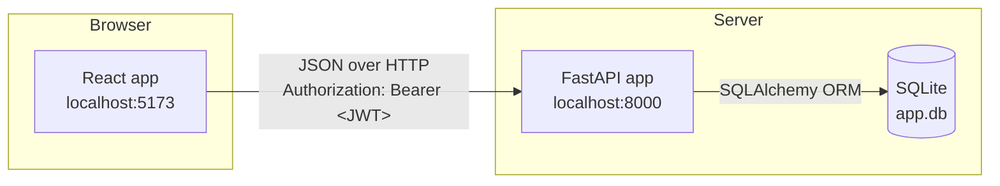
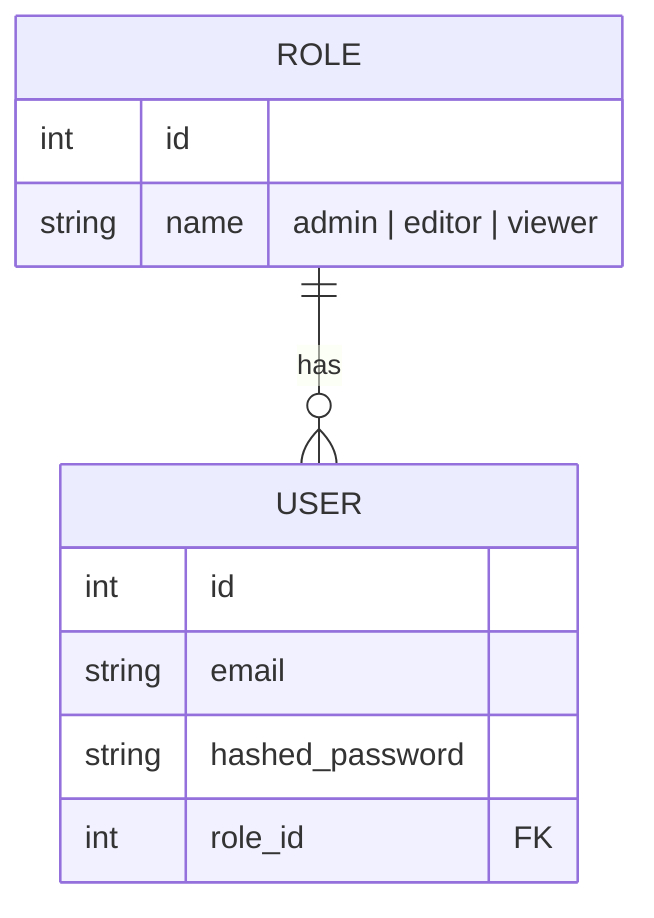

# Architecture

Vram Admin is two independent servers that talk over HTTP/JSON — there is
no server-side rendering or shared process:

| | |
|---|---|
| **Backend** | FastAPI (Python), SQLite via SQLAlchemy, JWT auth — `http://localhost:8000` |
| **Frontend** | React (Vite), React Router, axios — `http://localhost:5173` |



## Directory layout

```
backend/
  app/
    main.py            FastAPI app, CORS, router mount
    core/
      database.py      engine, session factory, get_db() dependency
      auth.py          password hashing, JWT issuing/verification, RBAC dependency
    models/            SQLAlchemy tables (Role, User)
    schemas/           Pydantic request/response shapes
    api/
      routers.py       API routes
  alembic/             migration environment + versions/
  alembic.ini          alembic config (points at app.db)
  seed.py              one-off script: creates roles + admin@vram.com
  app.db               SQLite database file (created on first run)

frontend/
  src/
    api.js                 shared axios instance + auth-header interceptor
    context/AuthContext.jsx  global auth state (user, login, logout)
    components/ProtectedRoute.jsx  route guard (auth + role check)
    pages/Login.jsx
    pages/Dashboard.jsx
    App.jsx        route table
    main.jsx       React entry point
```

## Backend layers

Each request flows through the same stack:

```
api/routers.py (route)
  -> Depends(auth.get_current_user) or Depends(auth.require_role(...))
       -> decodes JWT, loads User from DB               [core/auth.py]
  -> Depends(database.get_db)
       -> opens a SQLAlchemy session for this request only  [core/database.py]
  -> models (Role, User) via the SQLAlchemy ORM          [models/]
  -> schemas validates the response shape before it's sent [schemas/]
```

There is no in-memory application state between requests — the database
is the single source of truth. `get_db()` opens a session per request
and closes it in a `finally` block even if the route raises.

## Auth flow


Every subsequent request from the axios instance in `api.js` attaches
`Authorization: Bearer <token>` automatically via a request interceptor,
so individual components never handle the header themselves.

## RBAC model



Role checks happen in **two places**, deliberately:

- **Backend (`auth.require_role(...)` in `core/auth.py`)** — the real
  enforcement. Returns `403 Forbidden` before the route body runs if the
  caller's role isn't allowed. This cannot be bypassed by the client.
- **Frontend (`ProtectedRoute.jsx`, and conditional rendering in
  `Dashboard.jsx`)** — UX only. Hides links/cards and redirects so users
  don't hit dead ends, but a determined user could edit the JS and see
  restricted UI; the backend check is what actually protects the data.

| Route | Allowed roles | Enforced by |
|---|---|---|
| `POST /register` | anyone | — |
| `POST /login` | anyone | — |
| `GET /me` | any authenticated user | `get_current_user` |
| `GET /dashboard` | any authenticated user | `get_current_user` |
| `GET /editor/content` | `admin`, `editor` | `require_role("admin", "editor")` |
| `GET /admin/users` | `admin` | `require_role("admin")` |

See [API.md](API.md) for full request/response details on each route.

## Frontend state

- **`AuthContext`** holds `user`, `loading`, `login()`, `logout()` in
  React Context, read anywhere via the `useAuth()` hook — avoids prop
  drilling the current user through every component.
- On mount, if a token is already in `localStorage` (from a previous
  session), `AuthContext` calls `GET /me` to resolve it back into a user
  object; if that fails (expired/invalid token) it clears the stored
  token and falls back to logged-out.
- **`ProtectedRoute`** reads `useAuth()` and redirects to `/login` if
  there's no user, or to `/dashboard` if the user's role isn't in
  `allowedRoles`.

## Configuration notes

These are hardcoded for local development and called out here so
they're not missed before deploying anywhere real:

- `backend/app/core/auth.py` — `SECRET_KEY` is a literal string in source
  and `ACCESS_TOKEN_EXPIRE_MINUTES = 60` with no refresh-token flow.
- `backend/app/core/database.py` — `DATABASE_URL = "sqlite:///./app.db"`.
- `backend/app/main.py` — CORS is locked to `http://localhost:5173` only.
- `frontend/src/api.js` — `baseURL` is a literal `http://localhost:8000`.

See `STUDY_GUIDE.md` §10 for suggested next steps (env vars, refresh
tokens, swapping SQLite for Postgres).
