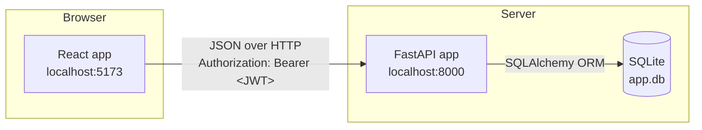
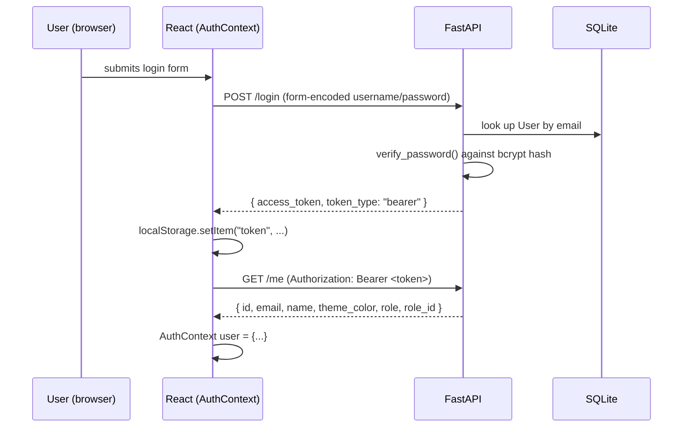
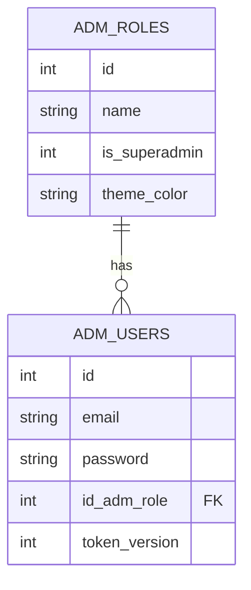

# Architecture

Vram Admin is two independent servers that talk over HTTP/JSON — there is
no server-side rendering or shared process:

| | |
|---|---|
| **Backend** | FastAPI (Python), SQLite via SQLAlchemy, JWT auth — `http://localhost:8000` |
| **Frontend** | React (Vite), React Router, axios — `http://localhost:5173` |



## Directory layout

```
backend/
  app/
    main.py            FastAPI app, CORS, RequireAuthMiddleware, router mount
    core/
      database.py      engine, session factory, get_db() dependency
      auth.py          password hashing, JWT issuing/verification, RBAC dependency
      middleware.py    RequireAuthMiddleware — fail-closed 401 for any route
                        not in PUBLIC_PATHS, before the route even runs
    models/            SQLAlchemy tables (Role, User, Modules, Menuses)
    schemas/           Pydantic request/response shapes (UserOut, Token,
                        ModuleOut, MenuOut)
    api/
      routers.py       combines every feature router below — the only
                        file main.py imports; adding a new feature area
                        means adding a router here, not touching main.py
      serializers.py   User -> UserOut, shared by auth.py and admin.py
      auth.py          /register, /login, /logout, /me
      dashboard.py     /dashboard
      sidebar.py       /sidebar
      admin.py         /admin/users
      editor.py        /editor/content
  alembic/             migration environment + versions/ (see MIGRATIONS.md)
  alembic.ini          alembic config (points at app.db)
  seed.py              one-off script: creates the Super Administrator role + admin@vram.com
  app.db               SQLite database file (created on first run)

frontend/
  src/
    api.js                 shared axios instance + auth-header interceptor
    context/AuthContext.jsx  global auth state (user, login, logout)
    components/ProtectedRoute.jsx  route guard (auth + role check)
    layout/Sidebar.jsx      fetches GET /sidebar, groups by module.is_protected
    layout/Navbar.jsx
    layout/Layout.jsx
    pages/Login.jsx
    pages/Dashboard.jsx
    App.jsx        route table
    main.jsx       React entry point
```

## Backend layers

Each request flows through the same stack:

```
core/middleware.py (RequireAuthMiddleware)
  -> 401 immediately if the path isn't public and there's no valid Bearer token
api/<feature>.py (route, e.g. api/sidebar.py)
  -> Depends(auth.get_current_user) or Depends(auth.require_role(...))
       -> decodes JWT, loads User from DB               [core/auth.py]
  -> Depends(database.get_db)
       -> opens a SQLAlchemy session for this request only  [core/database.py]
  -> models (Role, User, Modules, Menuses) via the SQLAlchemy ORM  [models/]
  -> schemas validates the response shape before it's sent [schemas/]
```

`RequireAuthMiddleware` and each route's `Depends(auth.get_current_user)`
both call the same `auth.get_user_from_token()` — the middleware is a
fail-closed backstop (a route added without an explicit `Depends` is
still protected), the per-route dependency is what actually hands the
`User` object to the route body.

There is no in-memory application state between requests — the database
is the single source of truth. `get_db()` opens a session per request
and closes it in a `finally` block even if the route raises.

## Auth flow



Every subsequent request from the axios instance in `api.js` attaches
`Authorization: Bearer <token>` automatically via a request interceptor,
so individual components never handle the header themselves.

`POST /logout` bumps `adm_users.token_version`; `get_user_from_token()`
rejects any token whose embedded `token_version` no longer matches the
database, so a logged-out token stops working immediately rather than
just being forgotten client-side.

## RBAC model



Only one role is seeded today — **Super Administrator** (`id = 1`,
`is_superadmin = 1`) — via `backend/seed.py`. The model supports more
roles (`adm_roles` is a normal table), but nothing in the UI creates
them yet.

Role checks happen in **two places**, deliberately:

- **Backend (`auth.require_role(...)` in `core/auth.py`)** — the real
  enforcement. Checks `id_adm_role` against a set of allowed role ids
  (not names, so a role can be renamed without breaking every route
  that requires it) and returns `403 Forbidden` before the route body
  runs. This cannot be bypassed by the client.
- **Frontend (`ProtectedRoute.jsx`, and conditional rendering in
  `Dashboard.jsx`)** — UX only. Hides links/cards and redirects so users
  don't hit dead ends, but a determined user could edit the JS and see
  restricted UI; the backend check is what actually protects the data.

| Route | Allowed | Enforced by |
|---|---|---|
| `POST /register` | anyone | — |
| `POST /login` | anyone | — |
| `POST /logout` | any authenticated user | `get_current_user` |
| `GET /me` | any authenticated user | `get_current_user` |
| `GET /dashboard` | any authenticated user | `get_current_user` |
| `GET /sidebar` | any authenticated user (superadmin sees every menu) | `get_current_user` + in-route `is_superadmin` check |
| `GET /admin/users` | role id `1` | `require_role(1)` |
| `GET /editor/content` | role id `1` (temporary — no editor role exists yet) | `require_role(1)` |

See [API.md](API.md) for full request/response details on each route.

## Sidebar and menus

Two tables drive the dynamic sidebar, both currently empty (no rows
seeded yet):

- **`adm_modules`** — a registerable feature area: `name`, `icon`,
  `path`, `table_name`, `controller`, `is_active`, and `is_protected`.
  `is_protected` does **not** mean "requires a role" — it marks a
  built-in admin module (Users Management, Menu Management, etc.) as
  opposed to a future user-generated one, purely so the frontend can
  group it into an "Admin" section of the sidebar.
- **`adm_menuses`** — one sidebar entry: `name`, `path`, `slug`, `icon`,
  `color`, `sorting`, `patent_id` (FK -> `adm_modules.id`, the parent
  module), and `id_adm_role` (FK -> `adm_roles.id`, who can see it).

`GET /sidebar` (`api/sidebar.py`) queries `adm_menuses` joined to its
parent `adm_modules` row, filtered to active menus under active modules
and matching the caller's `id_adm_role` (or every menu, if the caller is
a superadmin), ordered by `sorting`. `Sidebar.jsx` then splits the
result into two rendered groups by `module.is_protected` — no second
table or endpoint needed for the admin-vs-regular split. `Dashboard` is
a third, hardcoded link in `Sidebar.jsx` with no `adm_menuses` row at
all, since every signed-in user always sees it.

## Frontend state

- **`AuthContext`** holds `user`, `loading`, `login()`, `logout()` in
  React Context, read anywhere via the `useAuth()` hook — avoids prop
  drilling the current user through every component.
- On mount, if a token is already in `localStorage` (from a previous
  session), `AuthContext` calls `GET /me` to resolve it back into a user
  object; if that fails (expired/invalid/revoked token) it clears the
  stored token and falls back to logged-out.
- **`ProtectedRoute`** reads `useAuth()` and redirects to `/login` if
  there's no user.
- **`Sidebar`** fetches `GET /sidebar` on mount and renders it grouped
  by `module.is_protected` — see "Sidebar and menus" above. It refetches
  only on mount, so a menu/role change elsewhere requires a page reload
  to show up, same caveat as `AuthContext`'s `user`.

## Configuration notes

These are hardcoded for local development and called out here so
they're not missed before deploying anywhere real:

- `backend/app/core/auth.py` — `SECRET_KEY` is a literal string in source
  and `ACCESS_TOKEN_EXPIRE_MINUTES = 60` with no refresh-token flow.
- `backend/app/core/database.py` — `DATABASE_URL = "sqlite:///./app.db"`.
- `backend/app/main.py` — CORS is locked to `http://localhost:5173` only.
- `frontend/src/api.js` — `baseURL` is a literal `http://localhost:8000`.

See `STUDY_GUIDE.md` §10 for suggested next steps (env vars, refresh
tokens, swapping SQLite for Postgres).
