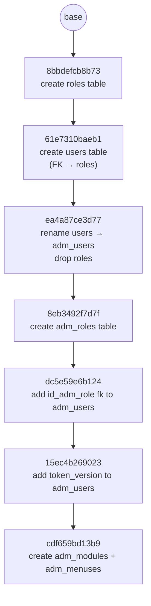

# Database Migrations (Alembic)

## Steps to run a migration

1. Add or change a model in `backend/app/models/__init__.py` (new class =
   new table, new `Column(...)` = new column, etc.). Save the file.
2. Make sure the app (`uvicorn`) is **not** running.
3. Open a terminal in `backend/`.
4. Run:
   ```bash
   alembic revision --autogenerate -m "short description of the change"
   ```
5. Open the new file it created in `backend/alembic/versions/` and read it.
   - Does it look right? Continue to step 6.
   - Is it empty (`upgrade()` just says `pass`)? Stop — go to
     [If the migration file is empty](#if-the-migration-file-is-empty).
6. Run:
   ```bash
   alembic upgrade head
   ```
7. Done. Start `uvicorn` again.

## If the migration file is empty

This means the table/column already exists in `backend/app.db` — usually
because the app was started (step 2 was skipped) and
`Base.metadata.create_all()` created it before you ran `alembic revision`.

1. Delete the file alembic just generated (the empty one).
2. Find the table your model change added, and drop it:
   ```bash
   cd backend
   python -c "import sqlite3; c=sqlite3.connect('app.db'); c.execute('DROP TABLE your_table_name'); c.commit()"
   ```
3. Go back to step 3 of [Steps to run a migration](#steps-to-run-a-migration).

Not sure if your table is one of the auto-created ones? List every table in
the database and compare against what you expect:
```bash
cd backend
python -c "import sqlite3; print(sqlite3.connect('app.db').cursor().execute(\"SELECT name FROM sqlite_master WHERE type='table'\").fetchall())"
```

---

## Reference

Everything below is background — you don't need it for the normal
add-a-migration flow above.

### What a migration is

A migration is a small Python file with `upgrade()` and `downgrade()`
functions — `upgrade()` describes one schema change (e.g. "create this
table"), `downgrade()` undoes it. Alembic chains migrations together and
applies whichever ones a given database is missing, in order.

### Why not just `Base.metadata.create_all()`?

`backend/app/main.py` calls `Base.metadata.create_all(bind=engine)` on every
startup — a SQLAlchemy convenience that creates any table that doesn't exist
yet, straight from the current models. It's fine for a brand-new empty
database, but it can't:

- **Change an existing table** (add a column, rename one, add an index) —
  it only creates missing tables, never alters existing ones.
- **Give you a history** — a reviewable, ordered record of every schema
  change that can be replayed on a teammate's machine or a server.

This is also *why* the empty-migration problem above happens at all —
`create_all()` runs on every app startup and quietly beats Alembic to
creating any new table.

### How it's wired up

| File | Role |
|---|---|
| `backend/alembic.ini` | Alembic's config. `sqlalchemy.url` points at the same `sqlite:///./app.db` used by `database.py`. |
| `backend/alembic/env.py` | Runs on every alembic command. Adds `backend/` to `sys.path`, imports `app.core.database.Base` and `app.models`, and sets `target_metadata = Base.metadata` — this is what lets `--autogenerate` diff your models against the live database. |
| `backend/alembic/versions/*.py` | One file per migration, oldest to newest, linked by `revision` / `down_revision`. |

### Autogenerate isn't magic — always review the file

- It **will not** detect a column rename — it sees "drop old column, add new
  column" (which loses data) unless you edit it into `op.alter_column(...)`.
- It **will not** detect table renames, check constraints, or some index
  details reliably.

### Command reference

Run these from `backend/`.

| Command | What it does |
|---|---|
| `alembic current` | Shows which revision the database is stamped at. |
| `alembic history` | Lists every migration and how they chain together. |
| `alembic revision --autogenerate -m "..."` | Generate a new migration from the model/DB diff. |
| `alembic revision -m "..."` | Generate a new **empty** migration to fill in by hand. |
| `alembic upgrade head` | Apply all pending migrations, up to the latest. |
| `alembic upgrade +1` | Apply just the next pending migration. |
| `alembic downgrade -1` | Undo the most recently applied migration. |
| `alembic downgrade base` | Undo everything, back to an empty schema. |
| `alembic stamp head` | Mark the database as being at `head` **without running any migrations.** |

`stamp` doesn't touch any tables — it only writes a revision id into the
`alembic_version` table, telling Alembic "trust me, the schema already
matches this revision." Use it only when the schema and models truly already
match and you don't need a reviewable migration file (e.g. bootstrapping
Alembic onto a database that already has the right tables). It's bookkeeping,
not a schema change — prefer the drop-and-regenerate approach above when you
want an honest, replayable history.

### This project's migration history



1. **`8bbdefcb8b73_create_roles_table.py`** — creates `roles` (`id`, `name`).
2. **`61e7310baeb1_create_users_table.py`** — creates `users`
   (`id`, `email`, `hashed_password`, `role_id` FK → `roles.id`).
3. **`ea4a87ce3d77_rename_users_to_adm_users_drop_roles.py`** — drops
   `users` and `roles`, creates `adm_users` with the expanded column set
   (`name`, `email_verified_at`, `password`, `id_adm_privileges`, `status`,
   `last_password_updated`, `waiver_count`, `theme`, `remember_token`,
   `created_by/at`, `updated_by/at`). Autogenerate can't detect table
   renames, so this file was hand-edited to add the `adm_users`
   `create_table` — the raw output only had the `drop_table`s.
4. **`8eb3492f7d7f_create_adm_roles_table.py`** — creates `adm_roles`
   (`id`, `name`, `is_superadmin`, `theme_color`, `created_at`,
   `updated_at`).
5. **`dc5e59e6b124_add_id_adm_role_fk_to_adm_roles.py`** — adds
   `id_adm_role` (FK → `adm_roles.id`) to `adm_users`, replacing the old
   unlinked `id_adm_privileges` column.
6. **`15ec4b269023_add_token_version_to_adm_users.py`** — adds
   `token_version` (`Integer`, default `0`) to `adm_users`, used to
   invalidate issued tokens (e.g. on password change).
7. **`cdf659bd13b9_create_adm_modules_and_adm_menuses_.py`** — creates
   `adm_modules` and `adm_menuses` (`adm_menuses.patent_id` FK →
   `adm_modules.id`, `adm_menuses.id_adm_role` FK → `adm_roles.id`).

Run `alembic history` any time to see the current chain, or `alembic current`
to see where `app.db` is stamped.
