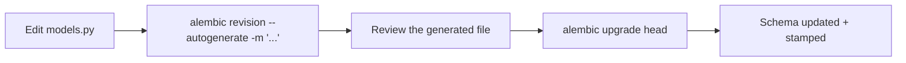
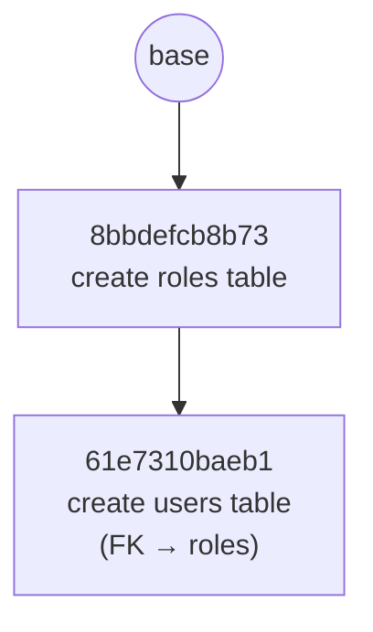

# Database Migrations (Alembic)

Alembic is the migration tool for the SQLAlchemy models in `backend/app/models/`.
A **migration** is a small Python file with an `upgrade()` and `downgrade()`
function — `upgrade()` describes one schema change (e.g. "create this table"),
`downgrade()` undoes it. Alembic chains migrations together and applies
whichever ones a given database is missing, in order.

This doc covers the full lifecycle: how it's wired up, how to add a new
migration, and how to apply/undo them.

## Why not just `Base.metadata.create_all()`?

`backend/app/main.py` also calls `Base.metadata.create_all(bind=engine)` on every
startup — that's a SQLAlchemy convenience that creates any table that doesn't
exist yet, straight from the current models. It's fine for a brand-new empty
database, but it can't do the two things migrations are actually for:

- **Change an existing table** (add a column, rename one, add an index) —
  `create_all()` only ever creates missing tables, it never alters existing ones.
- **Give you a history** — a reviewable, ordered record of every schema
  change, that can be replayed on a teammate's machine or a server.

Keep this in mind: as long as `create_all()` runs on startup, it will create
new tables *before* you get a chance to generate a migration for them (see
[Gotcha: autogenerate finds nothing](#gotcha-autogenerate-finds-nothing)
below). `create_all()` currently lives in `backend/app/main.py`.

## How it's wired up

| File | Role |
|---|---|
| `backend/alembic.ini` | Alembic's config. `sqlalchemy.url` points at the same `sqlite:///./app.db` used by `database.py`. |
| `backend/alembic/env.py` | Runs on every alembic command. Adds `backend/` to `sys.path` so the `app` package is importable, imports `app.core.database.Base` and `app.models` (so `Base.metadata` knows about `Role`/`User`), and sets `target_metadata = Base.metadata` — this is what lets `--autogenerate` diff your models against the live database. |
| `backend/alembic/versions/*.py` | One file per migration, oldest to newest, linked by `revision` / `down_revision`. |

## The full cycle



### 1. Change a model

Edit `backend/app/models/__init__.py` — add a table (new class), add a column, etc.

### 2. Generate a migration

```bash
cd backend
alembic revision --autogenerate -m "add avatar_url to users"
```

This creates a new file in `backend/alembic/versions/`, pre-populated with
`op.add_column(...)` / `op.create_table(...)` calls — whatever Alembic
detected as the diff between your models and the current database schema.
`down_revision` is set automatically to whatever the current head is, so the
new file chains onto the existing history.

### 3. Review the generated file — don't skip this

Autogenerate is a diff tool, not magic. Always open the file it produced and
check it before applying:

- It **will not** detect a column rename — it sees "drop old column, add new
  column" (which loses data) unless you edit it into an `op.alter_column(...)`.
- It **will not** detect table/column renames, check constraints, or some
  index details reliably.
- If nothing changed between your models and the database, it generates an
  empty migration (`upgrade()`/`downgrade()` are just `pass`) — see the
  gotcha below for why that happens in this project specifically.

### 4. Apply it

```bash
alembic upgrade head
```

Runs every migration between the database's current revision and `head`, in
order, and records the new revision in the database's `alembic_version` table.

## Command reference

Run these from `backend/` (so `alembic.ini` is found).

| Command | What it does |
|---|---|
| `alembic current` | Shows which revision the database is stamped at. |
| `alembic history` | Lists every migration and how they chain together. |
| `alembic revision --autogenerate -m "..."` | Generate a new migration from the model/DB diff. |
| `alembic revision -m "..."` | Generate a new **empty** migration to fill in by hand. |
| `alembic upgrade head` | Apply all pending migrations, up to the latest. |
| `alembic upgrade +1` | Apply just the next pending migration. |
| `alembic downgrade -1` | Undo the most recently applied migration. |
| `alembic downgrade base` | Undo everything, back to an empty schema. |
| `alembic stamp head` | Mark the database as being at `head` **without running any migrations** — see below. |

### `stamp` — when the schema and the migration history disagree

`stamp` doesn't touch any tables. It only writes a revision id into the
database's `alembic_version` table, telling Alembic "trust me, the schema
already matches this revision." Use it when:

- You're bootstrapping Alembic onto a database that already has the right
  tables (e.g. created by `create_all()`, or restored from a backup) — you
  need the database "caught up" without re-running `CREATE TABLE` on tables
  that already exist (which would error).
- You've manually fixed a schema drift and just need the bookkeeping to
  match reality again.

It's a bookkeeping command, not a schema command — reach for `upgrade`/
`downgrade` for anything that should actually change tables.

## This project's migration history



Two migrations, split by table so each is independently revertible:

1. **`8bbdefcb8b73_create_roles_table.py`** — creates `roles` (`id`, `name`).
2. **`61e7310baeb1_create_users_table.py`** — creates `users`
   (`id`, `email`, `hashed_password`, `role_id` FK → `roles.id`).
   `down_revision` points at the roles migration, so `roles` is always
   created first — required, since `users.role_id` references it.

The live `backend/app.db` was stamped at `61e7310baeb1` rather than upgraded,
since the tables already existed (see the gotcha below). Run `alembic
history` any time to see the current chain, or `alembic current` to see
where `app.db` is stamped.

## Gotcha: autogenerate finds nothing

If you run `--autogenerate` and get an empty migration even though you just
added a model, it's almost always this sequence:

1. You add a new model in `app/models/__init__.py`.
2. You start the app (`uvicorn app.main:app`) before generating the migration.
3. `Base.metadata.create_all()` in `app/main.py` creates the new table directly.
4. You run `alembic revision --autogenerate` — but the database *already*
   matches your models, so there's no diff left to detect.

This is exactly what happened with the original `roles`/`users` migration in
this project. The fix in the moment is `alembic stamp head` (bookkeeping
only, schema already matches). The fix going forward is to stop relying on
`create_all()` once Alembic owns your schema — generate and run the
migration *before* starting the app.
