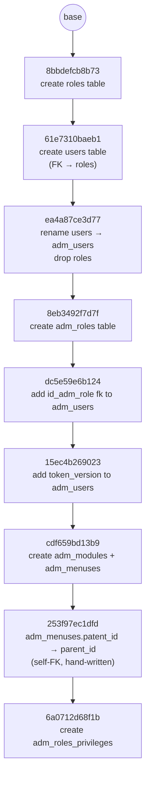

# Database Migrations (Alembic)

## Before you start

The database is PostgreSQL, not a file — the server has to be running and
`vram_admin` has to exist before any `alembic` command can connect. If
you have not done that yet, start with [DATABASE.md](DATABASE.md).

Alembic reads the connection string from `backend/app/core/database.py`
(through `alembic/env.py`), **not** from `alembic.ini` — that file has no
`sqlalchemy.url` line at all any more.

## Steps to run a migration

1. Add or change a model in `backend/app/models/` — one file per table
   (`role.py`, `user.py`, `module.py`, `menus.py`,
   `adm_roles_privileges.py`), all under `models/admin/`. A
   new `Column(...)` in an
   existing file needs nothing else; a **new table** means a new file *and* a
   re-export line in `backend/app/models/__init__.py`, or alembic won't see
   it (see [How it's wired up](#how-its-wired-up)). Save the file.
2. Nothing creates tables behind alembic's back any more — `main.py` and
   `seed.py` both stopped calling `Base.metadata.create_all()` — so there
   is no longer an ordering hazard here. (Leaving `uvicorn` running is
   fine, though a schema change under a live app is still worth avoiding.)
3. Open a terminal in `backend/`.
4. Run:
   ```bash
   alembic revision --autogenerate -m "short description of the change"
   ```
5. Open the new file it created in `backend/alembic/versions/` and read it.
   - Does it look right? Continue to step 6.
   - Is it empty (`upgrade()` just says `pass`)? Stop — go to
     [If the migration file is empty](#if-the-migration-file-is-empty).
6. Run:
   ```bash
   alembic upgrade head
   ```
7. Done — the schema is updated. Start `uvicorn` (or `python seed.py`)
   again whenever you like.

## If the migration file is empty

This means the table/column already exists in `vram_admin` — it was
created outside alembic, by hand in `psql` or by an older `seed.py` back
when that script still called `Base.metadata.create_all()`.

1. Delete the file alembic just generated (the empty one).
2. Find the table your model change added, and drop it:
   ```bash
   psql -h localhost -U vram -d vram_admin -c "DROP TABLE your_table_name;"
   ```
   No `psql` on your PATH? Do it through the app's own connection instead:
   ```bash
   cd backend
   python -c "from sqlalchemy import text; from app.core.database import engine; c = engine.connect(); c.execute(text('DROP TABLE your_table_name')); c.commit()"
   ```
3. Go back to step 3 of [Steps to run a migration](#steps-to-run-a-migration).

Not sure if your table is one of the auto-created ones? List every table in
the database and compare against what you expect:
```bash
psql -h localhost -U vram -d vram_admin -c "\dt"
```
or, again without `psql`:
```bash
cd backend
python -c "from sqlalchemy import inspect; from app.core.database import engine; print(inspect(engine).get_table_names())"
```

## If alembic can't locate a revision

```
ERROR [alembic.util.messaging] Can't locate revision identified by '4a53b9d60757'
FAILED: Can't locate revision identified by '4a53b9d60757'
```

The `alembic_version` table names a revision that no file in
`alembic/versions/` declares, so alembic cannot place the database on the
chain and refuses to do anything at all. **Every** command fails this way,
`alembic current` included — there is no read-only command that still
works, which is why the message looks identical whatever you were trying
to run.

It means a migration file was deleted (or never pulled) *after* this
database had already applied it. That is exactly what happened with
`4a53b9d60757`, the reverted `adm_admin_menuses` migration — see
[the history below](#this-projects-migration-history).

The fix is to re-point `alembic_version` at a revision that does exist,
normally the deleted one's parent:

```bash
cd backend
alembic stamp --purge 253f97ec1dfd
alembic upgrade head
```

`--purge` is the load-bearing flag. A plain `alembic stamp` resolves the
*current* revision before moving away from it, so it fails with the same
error you are trying to escape; `--purge` erases the version table first
and writes the new value into an empty one. `UPDATE alembic_version SET
version_num = '253f97ec1dfd'` in `psql` does the same thing by hand.

Two things to check afterwards, because stamping is bookkeeping and
changes no tables:

- **Whatever the deleted migration created is still there**, orphaned,
  and nothing will ever drop it now that its `downgrade()` is gone:
  ```bash
  psql -h localhost -U vram -d vram_admin -c "DROP TABLE adm_admin_menuses;"
  ```
- **Every revision after the stamped one is unapplied.** The `alembic
  upgrade head` above is what catches the database up; `alembic current`
  should then match the last entry in
  [this project's migration history](#this-projects-migration-history).

If the deleted file is still recoverable (`git show <commit>:<path>` will
print it), the tidier route is to restore it, run `alembic downgrade -1`
so its own `downgrade()` drops its table properly, then delete it again —
no orphan to clean up by hand. `--purge` is for when the file is already
gone.

---

## Reference

Everything below is background — you don't need it for the normal
add-a-migration flow above.

### What a migration is

A migration is a small Python file with `upgrade()` and `downgrade()`
functions — `upgrade()` describes one schema change (e.g. "create this
table"), `downgrade()` undoes it. Alembic chains migrations together and
applies whichever ones a given database is missing, in order.

### Why not just `Base.metadata.create_all()`?

`Base.metadata.create_all(bind=engine)` is a SQLAlchemy convenience that
creates any table that doesn't exist yet, straight from the current
models. It's fine for a brand-new empty database, but it can't:

- **Change an existing table** (add a column, rename one, add an index) —
  it only creates missing tables, never alters existing ones.
- **Give you a history** — a reviewable, ordered record of every schema
  change that can be replayed on a teammate's machine or a server.

`backend/app/main.py` used to call it on every startup. That call was
removed with the move to PostgreSQL, so **migrations are now the only
thing that creates or changes the schema** — which is also why a fresh
database needs an explicit `alembic upgrade head` before the app can
serve a request.

`backend/seed.py` used to call it too, so the seed script would work
against a completely empty database — which was the one remaining way to
hit the empty-migration problem above. It no longer does: it checks the
tables it writes to exist and tells you to run `alembic upgrade head` if
they do not. Nothing in the project creates schema except migrations.

### How it's wired up

| File | Role |
|---|---|
| `backend/alembic.ini` | Alembic's config. The `sqlalchemy.url` line was **deleted** — the URL now comes from `env.py` at runtime, so there is no second connection string to keep in sync with `database.py`. |
| `backend/alembic/env.py` | Runs on every alembic command. Adds `backend/` to `sys.path`; imports `Base` **and `DATABASE_URL`** from `app.core.database` and calls `config.set_main_option("sqlalchemy.url", DATABASE_URL)`, which fills in the URL `alembic.ini` no longer has; imports `app.models`; sets `target_metadata = Base.metadata`, which is what lets `--autogenerate` diff your models against the live database. It imports the models *package*, so a model file missing from `app/models/__init__.py` never reaches `Base.metadata` and is silently ignored. (Those imports sit *below* `config = context.config` on purpose — `set_main_option` needs that object to exist first.) |
| `backend/alembic/versions/*.py` | One file per migration, oldest to newest, linked by `revision` / `down_revision`. |

### Autogenerate isn't magic — always review the file

- It **will not** detect a column rename — it sees "drop old column, add new
  column" (which loses data) unless you edit it into `op.alter_column(...)`.
- It **will not** detect table renames, check constraints, or some index
  details reliably.

### Command reference

Run these from `backend/`.

| Command | What it does |
|---|---|
| `alembic current` | Shows which revision the database is stamped at. |
| `alembic history` | Lists every migration and how they chain together. |
| `alembic revision --autogenerate -m "..."` | Generate a new migration from the model/DB diff. |
| `alembic revision -m "..."` | Generate a new **empty** migration to fill in by hand. |
| `alembic upgrade head` | Apply all pending migrations, up to the latest. |
| `alembic upgrade +1` | Apply just the next pending migration. |
| `alembic downgrade -1` | Undo the most recently applied migration. |
| `alembic downgrade base` | Undo everything, back to an empty schema. |
| `alembic stamp head` | Mark the database as being at `head` **without running any migrations.** |
| `alembic stamp <rev>` | The same, at a specific revision rather than the latest. |
| `alembic stamp --purge <rev>` | Erase the version table *first*, then stamp. The recovery for a version row alembic can no longer resolve — see [If alembic can't locate a revision](#if-alembic-cant-locate-a-revision). |

`stamp` doesn't touch any tables — it only writes a revision id into the
`alembic_version` table, telling Alembic "trust me, the schema already
matches this revision." Use it only when the schema and models truly already
match and you don't need a reviewable migration file (e.g. bootstrapping
Alembic onto a database that already has the right tables). It's bookkeeping,
not a schema change — prefer the drop-and-regenerate approach above when you
want an honest, replayable history.

`--purge` is the exception to "use it only when the schema already
matches": there, the schema is not the problem and the version row is, and
it is the only form of `stamp` that works when alembic cannot resolve what
the database currently claims to be.

### This project's migration history



1. **`8bbdefcb8b73_create_roles_table.py`** — creates `roles` (`id`, `name`).
2. **`61e7310baeb1_create_users_table.py`** — creates `users`
   (`id`, `email`, `hashed_password`, `role_id` FK → `roles.id`).
3. **`ea4a87ce3d77_rename_users_to_adm_users_drop_roles.py`** — drops
   `users` and `roles`, creates `adm_users` with the expanded column set
   (`name`, `email_verified_at`, `password`, `id_adm_privileges`, `status`,
   `last_password_updated`, `waiver_count`, `theme`, `remember_token`,
   `created_by/at`, `updated_by/at`). Autogenerate can't detect table
   renames, so this file was hand-edited to add the `adm_users`
   `create_table` — the raw output only had the `drop_table`s.
4. **`8eb3492f7d7f_create_adm_roles_table.py`** — creates `adm_roles`
   (`id`, `name`, `is_superadmin`, `theme_color`, `created_at`,
   `updated_at`).
5. **`dc5e59e6b124_add_id_adm_role_fk_to_adm_roles.py`** — adds
   `id_adm_role` (FK → `adm_roles.id`) to `adm_users`, replacing the old
   unlinked `id_adm_privileges` column.
6. **`15ec4b269023_add_token_version_to_adm_users.py`** — adds
   `token_version` (`Integer`, default `0`) to `adm_users`, used to
   invalidate issued tokens (e.g. on password change).
7. **`cdf659bd13b9_create_adm_modules_and_adm_menuses_.py`** — creates
   `adm_modules` and `adm_menuses` (`adm_menuses.patent_id` FK →
   `adm_modules.id`, `adm_menuses.id_adm_role` FK → `adm_roles.id`).
8. **`253f97ec1dfd_menus_parent_id_self_reference_drop_.py`** — renames
   `adm_menuses.patent_id` to `parent_id` and re-points the FK from
   `adm_modules.id` to `adm_menuses.id`, so a menu's parent is another
   menu (an accordion group) rather than a module. **Hand-written, not
   autogenerated** — this is exactly the rename case from
   [Autogenerate isn't magic](#autogenerate-isnt-magic--always-review-the-file):
   the raw output was "drop `patent_id`, add `parent_id`", which throws
   the column's data away, so it was rewritten as a single
   `op.alter_column(..., new_column_name=...)`. The old values were ids
   into a *different* table, so they are meaningless under the new
   constraint (and any of them without a matching menu id would fail it);
   the migration clears them with `UPDATE adm_menuses SET parent_id =
   NULL` before adding the FK. `downgrade()` reverses all three steps,
   clearing the column again on the way back.
9. **`6a0712d68f1b_adm_roles_privileges_table.py`** — creates
   `adm_roles_privileges` (`id`, `is_visible`, `is_create`, `is_read`,
   `is_edit`, `is_delete`, `is_void`, `is_override`, `id_adm_roles`,
   `id_adm_modules`, `created_at`, `updated_at`) — no foreign keys, plain
   integer columns naming the role/module by id. This is the per-(role,
   module) CRUD-flag matrix `roles_module.py`'s permissions screen reads
   and writes.

   **This revision used to sit on top of a ninth migration,
   `4a53b9d60757_create_adm_admin_menuses.py`** — `adm_admin_menuses`,
   the table `GET /admin_sidebar` briefly read (see
   [api/sidebar.md](api/sidebar.md#changed-on-2026-09-03)). That table
   and its migration were reverted, and this file's `down_revision` was
   hand-edited from `'4a53b9d60757'` back to `'253f97ec1dfd'` so the
   chain stays contiguous with no gap — the file itself says so in a
   comment. **That is only safe on a database that never applied
   `4a53b9d60757` — and at least one had.** A database that did has an
   `alembic_version` row alembic can no longer place on this chain at
   all, so every command against it fails with `Can't locate revision
   identified by '4a53b9d60757'`, `alembic current` included. Recovery is
   `alembic stamp --purge 253f97ec1dfd`, then `alembic upgrade head` —
   which applies *this* revision for the first time, since it had been
   sitting unreachable behind the broken version row — plus a manual
   `DROP TABLE adm_admin_menuses` for the orphan the deleted migration
   left behind. Full walkthrough:
   [If alembic can't locate a revision](#if-alembic-cant-locate-a-revision).
   Worth checking before deleting any migration file that might already
   be applied somewhere.

The first seven were written while the project was still on SQLite and
replayed onto PostgreSQL with a single `alembic upgrade head` — no
rewrite needed. 8 and 9 were written against PostgreSQL directly, which
is why 8 can name a constraint (`adm_menuses_patent_id_fkey`) outright:
that is Postgres's own naming convention, and SQLite would never have
had a constraint to drop by name in the first place.

The `with op.batch_alter_table(...)` blocks in some of the first seven
are a SQLite artifact (`render_as_batch=True` in `env.py`): SQLite cannot
`ALTER TABLE`, so alembic copies the table instead. On PostgreSQL those
same blocks emit ordinary `ALTER TABLE`s, so they are harmless — the
setting can be dropped from `env.py` whenever SQLite stops mattering.

Run `alembic history` any time to see the current chain, or
`alembic current` to see which revision `vram_admin` is stamped at.
