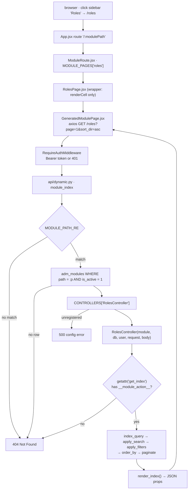

# Dynamic modules

The largest piece of this project, and the one with no equivalent in a
plain FastAPI tutorial: **a table row plus a class equals a working CRUD
API**. Add a row to `adm_modules`, write a `ModuleController` subclass
that declares its columns, and `GET /<path>` starts serving a searchable,
sortable, paginated list — with no new route, no new schema, and no
frontend file.

This is the Python port of the Laravel template's
`app/Helpers/GeneratedModuleController.php`. If you are reading this to
review the port, the [Laravel comparison](#laravel-comparison) section at
the bottom is the point; [LARAVEL.md](LARAVEL.md) covers the rest of the
stack the same way.

## The two halves of a module

| | |
|---|---|
| **A row in `adm_modules`** | `name`, `icon`, `path`, `table_name`, `controller`, `is_active`, `is_protected`. Admin-supplied data — this is what makes a module *discoverable at runtime*. |
| **A registered class** | A `ModuleController` subclass decorated with `@controller("...")`, whose string argument matches that row's `controller` column. Code — this is what makes a module *safe*. |

Neither half works alone. A row naming a controller nobody registered is
a `500`; a registered class with no active row is a `404`. The split is
deliberate: an admin can turn a module on and off, rename it, or change
its icon from the database, but cannot introduce new behaviour or reach a
new table without a code change.

`is_protected` does **not** mean "requires a role" — it marks a built-in
admin module as opposed to a future user-generated one, same as in
[ARCHITECTURE.md](ARCHITECTURE.md)'s note on the table.

## One request, end to end



Read the same path in the source in this order:
`api/dynamic.py` → `modules/registry.py` → `modules/base.py` →
`modules/roles_module.py`.

## The three routes

`api/dynamic.py` declares exactly three routes, each covering `GET` and
`POST` through `api_route(methods=[...])`:

| Route | Resolves to |
|---|---|
| `/{module_path}` | `get_index` / `post_index` |
| `/{module_path}/{action}` | `get_<action>` / `post_<action>` |
| `/{module_path}/{action}/{rest:path}` | the same, with the remaining segments passed as positional arguments |

`_method_name()` is the whole convention: lowercase the HTTP verb, append
`_index` when there is no action segment, otherwise append the action
with hyphens turned into underscores.

```
GET  /roles                 -> get_index()
GET  /users/edit/7          -> get_edit("7")
POST /users/bulk-action     -> post_bulk_action()
POST /roles/store           -> post_store()
```

Positional arguments arrive as **strings** — `rest.split("/")` with empty
segments dropped. Nothing coerces them, so a controller action that wants
an integer converts it itself.

### Why this router must be included last

```python
# routers.py
router.include_router(dynamic.router)   # MUST stay last
```

`"/{module_path}"` matches *any* single-segment path. Starlette resolves
routes first-match-wins in declaration order, so a router included after
this one would be shadowed entirely — `/dashboard` would be looked up as
a module named `dashboard` and 404. Every static feature router is
therefore included above it.

The frontend has the mirror-image constraint with the *opposite*
resolution rule: React Router v6 ranks routes by specificity rather than
declaration order, so `"/dashboard"` beats `"/:modulePath"` in `App.jsx`
no matter which is written first. Two catch-alls, two different reasons
they work.

## Where the trust boundaries are

`adm_modules` is admin-supplied data that reaches a query, and the action
name comes straight out of the URL. Seven allowlists stand between those
inputs and the database — worth knowing all of them, because each one is
load-bearing:

| Guard | In | Blocks |
|---|---|---|
| `MODULE_PATH_RE` (`^[a-z0-9_-]+$`) | `dynamic.py` | path traversal, uppercase or unicode lookalikes, and anything containing a `%` or a `.`, before the value touches a query |
| `is_active == 1` filter | `dynamic.py` | a disabled module, without deleting its row |
| `CONTROLLERS` dict | `registry.py` | any controller string an admin invents. The dict *is* the allowlist — an unregistered name is a `500`, never a class lookup |
| `__module_action__` marker | `registry.py` / `dynamic.py` | an unguarded `getattr()` reaching any attribute on the instance. Python has no `public` keyword, so `@action` is that missing keyword |
| `inspect.signature().bind()` | `dynamic.py` | an arity mismatch, checked *before* the call so a real `TypeError` raised inside a controller is reported as a bug rather than swallowed into a `404` |
| `Base.metadata.tables[name]` | `base.py.__init__` | a bad `adm_modules.table_name`. Laravel's `DB::table()` accepts any string; resolving through SQLAlchemy metadata means a typo is a `500` here instead of arbitrary SQL later |
| Column allowlists | `base.py` | `?sort_by=`, `?<column>=`, and `?search=` are each intersected with the module's *declared* columns, so a hidden column cannot be sorted, filtered, or searched |

One more, easy to miss because it is a *negative* guard: `index_query()`
selects only the declared columns. Laravel's version does `table.*` and
filters at render time, which still pulls `adm_users.password` out of the
database; this never fetches it at all.

## The `ModuleController` contract

Everything a subclass can declare. Anything left alone falls back to the
value shown.

| Attribute | Default | Purpose |
|---|---|---|
| `table_name` | `None` → falls back to `adm_modules.table_name` | the table this module reads and writes |
| `primary_key` | `"id"` | column used for lookups, updates, deletes, and the React table's row key |
| `table_fields` | `{}` | the list view: `{"name": {"label": "Role"}}`. Order here is the column order in the UI |
| `form_fields` | `{}` | create/edit metadata **and** validation rules: `label`, `type`, `required`, `max` |
| `search_columns` | `[]` | allowlist for `?search=`; empty means search is a no-op |
| `default_sort` | `None` → `primary_key` | column used when `?sort_by=` is absent or rejected |
| `per_page` | `15` | default page size; `?per_page=` overrides it, capped at 100 |
| `has_created_at` / `has_updated_at` | `False` | whether to stamp timestamps on write |
| `actions` | all four `True` | capability flags for `view` / `create` / `edit` / `delete` |

Four actions are inherited by every subclass, so a module that declares
only the attributes above already has all of them:

| Action | HTTP | Does |
|---|---|---|
| `get_index` | `GET /<path>` | query → search → filter → sort → paginate → `render_index()` |
| `post_store` | `POST /<path>/store` | `require("create")`, validate, insert with `RETURNING`, commit |
| `post_update` | `POST /<path>/update` | `require("edit")`, validate, update by primary key, commit |
| `post_delete` | `POST /<path>/delete` | `require("delete")`, delete by primary key, commit |

And eight hooks, all no-ops by default, for the module-specific bits:

| Hook | When |
|---|---|
| `custom_index_query(stmt)` | after `index_query()`, before search/filter/sort — the place for a join or a scope |
| `index_row(row)` | per row, on the way out — computed or reformatted values |
| `before_store(payload)` / `before_update(payload, id)` | last chance to change what gets written (hash a password, force a default) |
| `after_store(payload, id)` / `after_update(payload, id)` / `after_delete(id)` | side effects once the commit has happened |
| `before_delete(id)` | guard or cascade before the row goes |

### A module in full

`roles_module.py` is the whole of the Roles module — no route, no schema,
no query:

```python
@controller("RolesController")
class RolesController(ModuleController):
    table_name = "adm_roles"
    primary_key = "id"
    default_sort = "id"
    search_columns = ["name"]
    has_created_at = True
    has_updated_at = True

    table_fields = {
        "id": {"label": "ID"},
        "name": {"label": "Role"},
        "is_superadmin": {"label": "Superadmin"},
        "theme_color": {"label": "Theme"},
    }

    form_fields = {
        "name": {"label": "Role", "type": "text", "required": True, "max": 255},
        "is_superadmin": {"label": "Superadmin", "type": "checkbox"},
        "theme_color": {"label": "Theme", "type": "text", "max": 255},
    }
```

`users_module.py` is the opposite: it overrides `get_index` with a stub
and adds `get_edit` / `post_bulk_action`, purely to demonstrate that a
subclass can bypass the metadata pipeline entirely and that the
dispatcher's rules hold. Its `not_reachable()` method carries no
`@action`, so requesting it returns `404` even though the method exists.
It is a reachability test, not a real Users module.

## What the frontend receives

`render_index()` is the contract. Everything the React runtime draws
comes from this one payload — which is why adding a module needs no
frontend change:

```json
{
  "module": { "name": "Roles", "path": "roles", "icon": "fa fa-key" },
  "primaryKey": "id",
  "columns": [
    { "key": "id", "label": "ID" },
    { "key": "name", "label": "Role" },
    { "key": "is_superadmin", "label": "Superadmin" },
    { "key": "theme_color", "label": "Theme" }
  ],
  "formFields": {
    "name": { "label": "Role", "type": "text", "required": true, "max": 255 },
    "is_superadmin": { "label": "Superadmin", "type": "checkbox" },
    "theme_color": { "label": "Theme", "type": "text", "max": 255 }
  },
  "actions": { "view": true, "create": true, "edit": true, "delete": true },
  "rows": [
    { "id": 1, "name": "Super Administrator", "is_superadmin": 1, "theme_color": null }
  ],
  "pagination": { "total": 1, "page": 1, "per_page": 15, "last_page": 1 }
}
```

Note `columns` is built from every key in `table_fields`, while `rows`
only carry columns that actually exist on the table — a `table_fields`
entry naming a column the table doesn't have renders as a header with
empty cells rather than an error.

Full parameter and error reference: [api/modules.md](api/modules.md).

### The React side

Three files, and only one of them ever needs editing:

| File | Role |
|---|---|
| `pages/ModuleRoute.jsx` | sits behind the single `/:modulePath` route, looks the path up in `MODULE_PAGES`, and falls back to the shared runtime. `key={modulePath}` forces a remount so a new module never shows the previous one's rows while loading |
| `pages/modulePages.js` | `{ roles: RolesPage }` — the only place a module's custom page is named |
| `pages/admvram/vramjsx/GeneratedModulePage.jsx` | the shared runtime: search box, sortable headers, pager, row rendering. **Do not edit this for one module** |

A wrapper page passes in only what is specific to its module.
`RolesPage.jsx` passes a single `renderCell` that draws `is_superadmin`
as a badge and `theme_color` as a swatch, and inherits everything else.

| Prop | Purpose |
|---|---|
| `modulePath` | overrides the `:modulePath` route param |
| `title` | overrides the heading, which defaults to the module's `name` |
| `renderCell(row, column, defaultCell)` | per-cell rendering; the third argument is the runtime's own renderer, so you can special-case one column and defer the rest |
| `renderBeforeTable(data)` / `renderAfterTable(data)` | inject nodes around the table, given the whole response |
| `indexButtons` | `[{ label, onClick(reload) }]` — toolbar buttons; each gets `reload` so an action can refresh the table without owning its state |
| `actions` | capability flags, normalised through a `toBoolean` helper so the backend's `1`/`0`/`"true"` all become real booleans |
| `customRowActions` | `[{ label, action, icon, url, method, confirm, payload, visibleWhen, newTab, reload }]` — per-row actions, filtered per row by `visibleWhen` |
| `customRowActionHandlers` | `{ [action]: fn(button, row) }` — overrides the default URL-based handling for a named action |

Note `actions` is read from the *prop*, not from `data.actions`, even
though the backend sends the flags on every index response. Deciding
which of the two wins is still open.

### The row-actions column is mid-port

An actions column was added to `<tbody>` on 2026-08-31, built from three
components — `RowActions` (the cluster), `RowAction` (one icon button,
using `lucide-react`), and `RowData` (a styled `<td>`). It is **pasted
from the Laravel/Inertia original and not yet adapted**, so it compiles
but throws on render. Ten identifiers have no definition in this project:

| Missing | Was, in Laravel | Needs, here |
|---|---|---|
| `router` (×3) | Inertia's `router` | `useNavigate()` from React Router |
| `axios` | a global | the shared `api` instance from `src/api.js` |
| `openView`, `openEdit`, `handleDelete` | modal helpers in the original page | to be written, or dropped for now |
| `moduleAccess` (×2) | per-module permissions from Inertia shared props | the backend has no equivalent yet — see [Known gaps](#known-gaps) |
| `useEditRoute` | a page-level flag | a prop or a constant |
| `handleToast` (×2) | a toast helper | to be written |
| `resolveTemplate`, `resolvePayload` | helpers for `{id}`-style URL templates | to be written |

There is also a **column-count mismatch**: `<thead>` emits one `<th>` per
declared column, while each `<tbody>` row now emits that many `<td>`s
*plus* the actions `RowData`, so the header is one cell short.

Until those are resolved, a module page with rows will fail with a
`ReferenceError` rather than render.

## Adding a module

Say you want Menu Management on `adm_admin_menuses`.

Worth knowing before step 1: **nothing seeds `adm_modules`.** `seed.py`
creates only the Super Administrator role and the admin login, and no
migration inserts module rows, so the `roles` row that exists today was
added by hand — and a freshly migrated database has no modules at all.
Extending `seed.py` to insert the built-in module and menu rows is
probably the single highest-value change to make here.

1. **Insert the `adm_modules` row.**

   ```sql
   INSERT INTO adm_modules (name, icon, path, table_name, controller, is_active, is_protected)
   VALUES ('Menus', 'fa fa-bars', 'menus', 'adm_admin_menuses', 'MenusController', 1, 1);
   ```

2. **Write the controller** as `backend/app/modules/menus_module.py`,
   declaring `table_fields`, `form_fields`, and `search_columns`. The
   `@controller("MenusController")` string must match the `controller`
   column exactly.

3. **Register it** by adding one import to `modules/__init__.py`:

   ```python
   from app.modules import menus_module  # noqa: F401
   ```

   The import is not decoration — importing the file is what runs the
   `@controller` decorator and puts the class in `CONTROLLERS`. Skip this
   and the route returns `500 unregistered controller`.

4. **Add the sidebar row**, and make `slug` match `adm_modules.path`:

   ```sql
   INSERT INTO adm_admin_menuses (name, slug, path, icon, is_active, sorting)
   VALUES ('Menus', 'menus', 'menus', 'fa fa-bars', 1, 2);
   ```

   This is the sharpest footgun in the system. `Sidebar.jsx` builds its
   link from the row's **`slug`** in `adm_admin_menuses`, while
   `dynamic.py` resolves the module by **`path`** in `adm_modules`. The
   two tables have no foreign key between them and nothing validates the
   pair, so a mismatched `slug` produces a sidebar link that 404s with
   both rows looking perfectly correct.

5. **Restart uvicorn.** `--reload` picks up the new file, but the
   `adm_modules` row is read per request, so changing a row needs no
   restart at all.

6. **Frontend: nothing.** `ModuleRoute` falls back to
   `GeneratedModulePage`, so the module is already browsable. Add a
   wrapper page and a line in `modulePages.js` only when you want custom
   cell rendering or extra buttons.

## Laravel comparison

The Python is a port, and `base.py`'s own comments name the Laravel
methods it is standing in for. Mapping, with the divergences called out
separately below:

| Concept | Laravel template | This project |
|---|---|---|
| The shared CRUD engine | `app/Helpers/GeneratedModuleController.php` | `app/modules/base.py` — `ModuleController` |
| Field config normalising | `normalizeFieldConfiguration()` | `ModuleController.__init__` derives `columns`, `column_labels`, `form_columns` once |
| Index props | `renderIndex()` | `render_index()` |
| Sort allowlist | `sortColumn()` | `order_by()` |
| Write permission checks | `CommonHelpers::isCreate()` / `isUpdate()` / `isDelete()` | `require("create")` / `require("edit")` / `require("delete")` |
| Table access | `DB::table($module->table_name)` | `Base.metadata.tables[name]` lookup |
| Insert and get id | `insertGetId()` | Postgres `RETURNING` in one statement |
| Validation rules | Laravel `Validator` rules on the field config | `validate()` reading `required` and `max` out of `form_fields` |
| Controller resolution | the module row's controller string, resolved by Laravel | `@controller(...)` → the `CONTROLLERS` dict |
| Reachable methods | Laravel reflects over **public** methods | `@action`, because Python has no `public` keyword |
| Page resolution | Inertia resolving a controller's `$viewName` to a component | `MODULE_PAGES` in `modulePages.js` |
| Shared page runtime | `resources/js/Pages/AdmVram/VramJsx/GeneratedModulePage.jsx` | `pages/admvram/vramjsx/GeneratedModulePage.jsx` — same file, same job |
| A module's own page | `resources/js/Pages/Roles/Roles.jsx` | `pages/admvram/RolesPage.jsx` |
| How props arrive | one Inertia response carrying page and props together | two hops: HTML from Vite, then JSON from `GET /<path>` |

Everything above the last row is either quoted from a comment in
`base.py` / `modulePages.js` / `RolesPage.jsx` or is stock
Laravel/Inertia behaviour. The paths under `resources/js/Pages/` are the
ones those comments name; nothing else about the Laravel repo is assumed
here.

### Where this deliberately diverges

Five differences are choices, not gaps, and each one is annotated in the
source:

- **The table name is resolved, not interpolated.** `DB::table()` takes
  any string. Going through `Base.metadata.tables` means an unknown
  `table_name` fails loudly at construction time.
- **Only declared columns are selected.** The Laravel version selects
  `table.*` and filters when rendering, so a password hash is read from
  the database and then discarded. Here it is never in the result set.
- **`@action` replaces reflection over public methods.** An unguarded
  `getattr()` on a URL-supplied name would reach *any* attribute on the
  object, so reachability is opt-in per method.
- **Arity is checked before the call.** Wrapping the call in
  `try/except TypeError` would turn a genuine `TypeError` from inside a
  controller into a misleading `404`.
- **`RETURNING` replaces the `insertGetId()` dance.** One statement, no
  follow-up query.

One caveat is inherited from the Laravel original rather than fixed:
`payload()` drops `None` values, so **a nullable field cannot be cleared
through the default path** — setting `theme_color` back to empty leaves
the old value. Override `payload()` or `before_update()` in a module that
needs it.

## Known gaps

Read this section before treating the module system as finished.

- **Write actions work as of 2026-08-31.** They did not before: all three
  handlers in `api/dynamic.py` passed `_read_body(request)` — an
  `async def`, so a *coroutine* — into `_dispatch` without `await`. A
  coroutine is truthy, so `self.body = body or {}` stored the coroutine
  itself and the first `self.body.get(...)` raised
  `AttributeError: 'coroutine' object has no attribute 'get'`. The fix was
  one keyword per call site, `body=await _read_body(request)`. Verified
  against the running API: `store` (with `create` enabled), `update`,
  `delete`, and a `422` on a missing required field all behave.
- **No create or edit UI exists.** `GeneratedModulePage` only issues a
  `GET`; `formFields` is delivered to the browser and currently unused.
- **The row-actions column throws.** It is rendered but references ten
  identifiers that do not exist in this project, most of them Inertia
  APIs — see [above](#the-row-actions-column-is-mid-port). Its header row
  is also one cell short of its body rows.
- **No per-module permissions.** The pasted column expects a
  `moduleAccess` object with `update` / `delete` flags. Nothing on the
  backend produces one: `render_index()` sends the module's `actions`
  flags, which are the same for every caller. A real `moduleAccess` needs
  role-aware capabilities, which is the same gap as "`require()` is not
  authorization" above.
- **`require()` is not authorization.** It enforces the module's own
  `actions` flags, which are the same for every caller. There is no
  per-role check on any module route — a valid token is enough. Real
  RBAC on modules means either `Depends(auth.require_role(...))` on the
  dynamic router or a role column consulted inside `require()`.
- **No row-level scoping.** Any authenticated user who knows a module's
  path sees every row of its table.
- **`users_module.UsersController` is a demo**, not a Users module — it
  returns stub data from an overridden `get_index`.
- **The `slug` / `path` coupling is unvalidated**, as described in step 4
  above.

## See also

- [ARCHITECTURE.md](ARCHITECTURE.md) — where this sits in the request stack
- [api/modules.md](api/modules.md) — route, parameter, and error reference
- [LARAVEL.md](LARAVEL.md) — the rest of the stack, in Laravel terms
- [DATABASE.md](DATABASE.md) — inspecting `adm_modules` with `psql`
