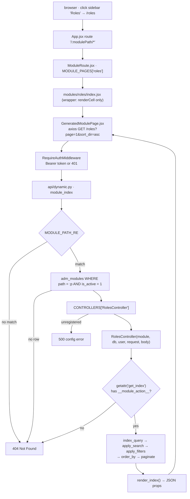

# Dynamic modules

The largest piece of this project, and the one with no equivalent in a
plain FastAPI tutorial: **a table row plus a class equals a working CRUD
API**. Add a row to `adm_modules`, write a `ModuleController` subclass
that declares its columns, and `GET /<path>` starts serving a searchable,
sortable, paginated list — with no new route, no new schema, and no
frontend file.

This is the Python port of the Laravel template's
`app/Helpers/GeneratedModuleController.php`. If you are reading this to
review the port, the [Laravel comparison](#laravel-comparison) section at
the bottom is the point; [LARAVEL.md](LARAVEL.md) covers the rest of the
stack the same way.

## The two halves of a module

| | |
|---|---|
| **A row in `adm_modules`** | `name`, `icon`, `path`, `table_name`, `controller`, `is_active`, `is_protected`. Admin-supplied data — this is what makes a module *discoverable at runtime*. |
| **A registered class** | A `ModuleController` subclass decorated with `@controller("...")`, whose string argument matches that row's `controller` column. Code — this is what makes a module *safe*. |

Neither half works alone. A row naming a controller nobody registered is
a `500`; a registered class with no active row is a `404`. The split is
deliberate: an admin can turn a module on and off, rename it, or change
its icon from the database, but cannot introduce new behaviour or reach a
new table without a code change.

`is_protected` does **not** mean "requires a role" — it marks a built-in
admin module as opposed to a future user-generated one, same as in
[ARCHITECTURE.md](ARCHITECTURE.md)'s note on the table.

## One request, end to end



Read the same path in the source in this order:
`api/dynamic.py` → `modules/registry.py` → `helpers/generated_module.py` →
`modules/roles_module.py`.

## The three routes

`api/dynamic.py` declares exactly three routes, each covering `GET` and
`POST` through `api_route(methods=[...])`:

| Route | Resolves to |
|---|---|
| `/{module_path}` | `get_index` / `post_index` |
| `/{module_path}/{action}` | `get_<action>` / `post_<action>` |
| `/{module_path}/{action}/{rest:path}` | the same, with the remaining segments passed as positional arguments |

`_method_name()` is the whole convention: lowercase the HTTP verb, append
`_index` when there is no action segment, otherwise append the action
with hyphens turned into underscores.

```
GET  /roles                 -> get_index()
GET  /users/edit/7          -> get_edit("7")
POST /users/bulk-action     -> post_bulk_action()
POST /roles/store           -> post_store()
```

Positional arguments arrive as **strings** — `rest.split("/")` with empty
segments dropped. Nothing coerces them, so a controller action that wants
an integer converts it itself.

### Why this router must be included last

```python
# routers.py
router.include_router(dynamic.router)   # MUST stay last
```

`"/{module_path}"` matches *any* single-segment path. Starlette resolves
routes first-match-wins in declaration order, so a router included after
this one would be shadowed entirely — `/dashboard` would be looked up as
a module named `dashboard` and 404. Every static feature router is
therefore included above it.

The frontend has the mirror-image constraint with the *opposite*
resolution rule: React Router v6 ranks routes by specificity rather than
declaration order, so `"/dashboard"` beats `"/:modulePath"` in `App.jsx`
no matter which is written first. Two catch-alls, two different reasons
they work.

## Where the trust boundaries are

`adm_modules` is admin-supplied data that reaches a query, and the action
name comes straight out of the URL. Ten allowlists stand between those
inputs and the database — worth knowing all of them, because each one is
load-bearing:

| Guard | In | Blocks |
|---|---|---|
| `MODULE_PATH_RE` (`^[a-z0-9_-]+$`) | `dynamic.py` | path traversal, uppercase or unicode lookalikes, and anything containing a `%` or a `.`, before the value touches a query |
| `is_active == 1` filter | `dynamic.py` | a disabled module, without deleting its row |
| `CONTROLLERS` dict | `registry.py` | any controller string an admin invents. The dict *is* the allowlist — an unregistered name is a `500`, never a class lookup. Filled by `registry.discover()` scanning `modules/admin/`, so the **filesystem** is what can add to it |
| `__module_action__` marker | `registry.py` / `dynamic.py` | an unguarded `getattr()` reaching any attribute on the instance. Python has no `public` keyword, so `@action` is that missing keyword |
| `inspect.signature().bind()` | `dynamic.py` | an arity mismatch, checked *before* the call so a real `TypeError` raised inside a controller is reported as a bug rather than swallowed into a `404` |
| `Base.metadata.tables[name]` | `generated_module.py.__init__` | a bad `adm_modules.table_name`. Laravel's `DB::table()` accepts any string; resolving through SQLAlchemy metadata means a typo is a `500` here instead of arbitrary SQL later |
| Column allowlists | `generated_module.py` | `?sort_by=`, `?<column>=`, and `?search=` are each intersected with the module's *declared* columns, so a hidden column cannot be sorted, filtered, or searched |
| `resolve_column()` | `generated_module.py` | a `join` or `select` naming a table or column that does not exist. Laravel pastes those strings into SQL; here they are looked up in `Base.metadata` and a miss is a `500` at construction time |
| Export column intersection | `post_export()` | a caller widening the export past the declared fields. `columns` from the request is intersected with `self.selected`, so `"password"` is dropped exactly the way `?password=x` is not a filter |
| `BULK_ACTION_RE` (`^[A-Za-z0-9_-]+$`) | `post_bulk_action()` | a `bulkAction` name carrying anything that reads as SQL or a path, before it is matched against the built-ins or the module's own list |

One more, easy to miss because it is a *negative* guard: `index_query()`
selects only the declared columns. Laravel's version does `table.*` and
filters at render time, which still pulls every column out of the
database; this only ever selects `table_fields` ∪ `form_fields`.

**That is narrower than "never fetches sensitive columns," and the gap is
real, not hypothetical.** `index_query()`'s `form_columns` fallback loop
exists so a form-only field — one declared in `form_fields` but not
`table_fields`, like a foreign key needed to prefill an edit form's select
— is still available on the row. The same loop has no concept of
"sensitive": `users_module.py` names `password` in `form_fields` (so the
create/edit form has a field for it) but not in `table_fields` (so it
doesn't render as a list column), and the loop pulls it into every
`GET /users` and `GET /users/edit/<id>` response anyway — verified
against the running API, the bcrypt hash comes back in the JSON. The fix
is a `type == "password"` exclusion in that loop; see
[Known gaps](#known-gaps).

## The `ModuleController` contract

Everything a subclass can declare. Anything left alone falls back to the
value shown.

| Attribute | Default | Purpose |
|---|---|---|
| `table_name` | `None` → falls back to `adm_modules.table_name` | the table this module reads and writes |
| `primary_key` | `"id"` | column used for lookups, updates, deletes, and the React table's row key |
| `table_fields` | `{}` | the list view: `{"name": {"label": "Role"}}`. Order here is the column order in the UI |
| `form_fields` | `{}` | create/edit metadata **and** validation rules: `label`, `type`, `required`, `max` |
| `search_columns` | `[]` | allowlist for `?search=`; empty means search is a no-op |
| `default_sort` | `None` → `primary_key` | column used when `?sort_by=` is absent or rejected |
| `per_page` | `15` | default page size; `?per_page=` overrides it, capped at 100 |
| `has_created_at` / `has_updated_at` | `False` | whether to stamp timestamps on write |
| `actions` | all four `True` | capability flags for `view` / `create` / `edit` / `delete` — **not a closed set**: a module can add its own keys (`"manage_permissions": True`) and gate a [custom action](#custom-actions) with `self.require("manage_permissions")`, the same way the built-in four gate `get_edit` / `post_store` / etc |
| `custom_row_actions` | `[]` | extra buttons in the row's action column: `[{"label", "icon", "url"}]`. A **static list**, not a function of the row — the React runtime expands `{id}` in `url` per row and applies `visibleWhen` itself |
| `custom_index_buttons` | `[]` | extra toolbar buttons: `[{"label", "action", "url"}]` |
| `custom_bulk_actions` | `[]` | extra bulk actions: `[{"label", "value"}]`. `value` must match `^[A-Za-z0-9_-]+$` or the entry is dropped |
| `bulk_actions` | `True` | `False` switches the whole bulk toolbar off, and makes `post_bulk_action` a `403` |
| `index_buttons` | all four `True` | toolbar switches: `add`, `export`, `refresh`, `bulk` |
| `use_add_route` | `False` | `True` makes **New** navigate to `/<path>/add` instead of opening the panel in place |
| `use_edit_route` | `False` | `True` makes **edit** navigate to `/<path>/edit/<id>` |

Four actions are inherited by every subclass, so a module that declares
only the attributes above already has all of them:

| Action | HTTP | Does |
|---|---|---|
| `get_index` | `GET /<path>` | query → search → filter → sort → paginate → `render_index()` |
| `get_add` | `GET /<path>/add` | `require("create")`, then the index props plus `pageMode: "create"` |
| `get_edit` | `GET /<path>/edit/<id>` | `require("edit")`, then the index props plus `pageMode: "edit"` and `editRow` |
| `post_store` | `POST /<path>/store` | `require("create")`, validate, insert with `RETURNING`, commit |
| `post_update` | `POST /<path>/update` | `require("edit")`, validate, update by primary key, commit |
| `post_delete` | `POST /<path>/delete` | `require("delete")`, delete by primary key, commit |
| `post_bulk_action` | `POST /<path>/bulk-action` | `delete`, `set_active`, `set_inactive`, or one of the module's own |
| `post_export` | `POST /<path>/export` | the list query minus pagination, streamed back as CSV or XLSX |

`get_add` and `get_edit` exist so the create/edit panel can be opened by
URL rather than by click — Laravel's `getAdd()` / `getEdit($id)`. They are
the index page plus a key or two, which is why `render_index()` takes an
`extra` dict: one props builder serves all three page modes.

`get_edit`'s `record_id` argument **must** keep its default. `dynamic.py`
checks arity with `signature().bind()` before dispatching, so without it a
bare `/<path>/edit` would `404` instead of opening an empty form.

And eight hooks, all no-ops by default, for the module-specific bits:

| Hook | When |
|---|---|
| `custom_index_query(stmt)` | after `index_query()`, before search/filter/sort — the place for a scope |
| `index_row(row)` | per row, on the way out — computed or reformatted values |
| `row_index(row)` | per row, for **presentation**: `{"status": {"label": "Active", "className": "status-badge"}}`. Merged over `global_row_index()` and delivered as the row's `__rowIndex` |
| `before_store(payload)` / `before_update(payload, id)` | last chance to change what gets written (hash a password, force a default) |
| `after_store(payload, id)` / `after_update(payload, id)` / `after_delete(id)` | side effects once the commit has happened |
| `before_delete(id)` | guard or cascade before the row goes |
| `before_bulk_delete(ids)` / `after_bulk_delete(ids)` | around a bulk delete |
| `before_bulk_status_update(ids, payload, is_active)` / `after_bulk_status_update(...)` | around a bulk set-active/set-inactive; the `before` hook returns the payload |
| `handle_custom_bulk_action(ids, name, config)` | reached only for a value the module declared in `custom_bulk_actions`, so an override can switch on `name` without re-checking it |

### The create/update ladder

`generate()`'s output stubs four rungs for `post_store` / `post_update`, each
strictly more powerful than the last, so a module takes only what it needs
and inherits the rest — `roles_module.py` uses all four:

| Rung | Override | Runs for |
|---|---|---|
| 2 | `validate(data)` | both create and update — business rules a `form_fields` dict cannot state (a uniqueness check, a privilege check). Call `super().validate(data)` first so `required` / `max` still apply |
| 1 | `before_store(payload)` / `before_update(payload, id)` | shaping the payload on its way into the write. **Must return the payload** — a bare mutation is silently dropped |
| 1 | `after_store(payload, id)` / `after_update(payload, id)` | side effects once the row has committed. Anything written here needs a commit of its own |
| 3 | `post_store()` / `post_update()` entirely | the write itself must differ — a second table, a transaction spanning both. Delegate to `super()` rather than retyping the insert, since the base method already runs `validate()` → `payload()` → `before_store()` → stamps → `RETURNING id` → `after_store()`, and every rung above still applies |

`validate()` is shared by both `post_store` and `post_update` — on update,
`self.body` carries the primary key, so a uniqueness check must exclude the
current row (`self.table.c[self.primary_key] != self.cast_key(current_id)`)
or a record collides with itself and can never be saved under its own value.

Overriding rung 3 needs one thing the lower rungs don't: **`@action` has to
be re-applied**. `dynamic.py` dispatches only on methods carrying
`__module_action__`, and an override is a new function object, so the base
class's decorator does not carry over — leave it off and the endpoint
`404`s, which reads like a missing route rather than a missing decorator.

All of this applies to every write path for the module at once — the
runtime's built-in panel, a `use_add_route` page, and any custom page under
`pages/modules/<path>/` — because all three `POST` to the same
`/<path>/store`. That is the reason to override here rather than add a
second endpoint for a custom page: two write paths drift, one does not.

### A module in full

`roles_module.py` is the whole of the Roles module — no route, no schema,
no query:

```python
@controller("RolesController")
class RolesController(ModuleController):
    table_name = "adm_roles"
    primary_key = "id"
    default_sort = "id"
    search_columns = ["name"]
    has_created_at = True
    has_updated_at = True

    table_fields = {
        "id": {"label": "ID"},
        "name": {"label": "Role"},
        "is_superadmin": {"label": "Superadmin"},
        "theme_color": {"label": "Theme"},
    }

    form_fields = {
        "name": {"label": "Role", "type": "text", "required": True, "max": 255},
        "is_superadmin": {"label": "Superadmin", "type": "checkbox"},
        "theme_color": {"label": "Theme", "type": "text", "max": 255},
    }
```

### Joined columns

A `table_fields` entry usually names a column on the module's own table.
It can instead point at another one, which is Laravel's
`applyTableFieldJoin()`:

```python
table_fields = {
    "id": {"label": "ID"},
    "name": {"label": "User"},
    "role_name": {
        "label": "Role",
        "select": "adm_roles.name",
        "join": {"table": "adm_roles",
                 "first": "adm_users.id_adm_role",
                 "second": "adm_roles.id"},
    },
}
```

`type` defaults to `"left"`; `"join"` or `"inner"` gives an inner join.
The same join declared on three fields still produces **one** `JOIN` —
deduplicated on `(type, table, first, second)`, as it is upstream.

The alias then behaves exactly like a local column: it can be searched,
filtered, sorted and exported with no special case anywhere. That is
because `resolve_fields()` builds one dict, `self.selected` (alias →
`Column`), and every downstream step reads it.

Where Laravel concatenates table and column names into SQL,
`resolve_column()` looks them up in `Base.metadata`, so a bad name is a
`500` at construction time rather than a query the database rejects
halfway through a request:

```
500 Module 'users' joins unknown table 'no_such_table'
500 Module 'users' references unknown column 'adm_roles.nope'
```

**Status badges.** If a joined table carries `badge_background_color` and
`badge_text_color`, that field renders as a coloured badge: the two
colours are selected under private `__badge_*` aliases, turned into
`__rowIndex` metadata by `global_row_index()`, and dropped from the row
before it ships. Colours run through `hex_color()`, so anything that is
not `#RRGGBB` falls back to a default rather than injecting a style.
Upstream this is hardcoded to a `statuses` table; here it is any joined
table with those two columns.

The example above is not hypothetical — `users_module.py` declares
exactly this `role_name` field to show each user's role in the list.

### FK-select form fields

`table_fields`' join resolves a joined column for *display*.
`form_fields` has a write-side counterpart for the same relationship: a
`type: "select"` field naming a table gets its `options` filled from that
table's live rows, instead of a module having to hardcode a snapshot of
them.

```python
form_fields = {
    "id_adm_role": {
        "label": "Role",
        "type": "select",
        "table": "adm_roles",
        "value_field": "id",
        "display_field": "name",
    },
}
```

`resolved_form_fields()` runs this per request, off a copy of
`form_fields` — the class-level dict itself is never mutated, so this is
safe across concurrent requests. A field that already declares `options`
(an enum column, from `build_meta()`) is left alone; only a `select`
field with a `table` and no `options` gets resolved. `value_field` and
`display_field` default to `"id"` and `"name"` if omitted.

As with joined `table_fields`, the field's own key must name a real
column — `form_columns` is filtered to `[c for c in form_fields if c in
self.table.c]`, so `role_id` on a table whose FK is actually
`id_adm_role` is silently dropped from every write, same failure mode as
a wrong join key.

**`type: "react-select"` is the same field, styled differently.**
`resolved_form_fields()` resolves `options` for it exactly like `"select"`
— the two types share one gate in `generated_module.py` — so everything
above applies unchanged. The only difference is which frontend widget
`GeneratedModulePage.jsx`'s form-field renderer picks: `"select"` is the
plain native `<select>` every module has always gotten, `"react-select"`
opts one field into the styled `react-select` control instead. It is a
per-field choice made by the controller that declares the field, not a
project-wide setting — `users_module.py`'s `id_adm_role` is the only
field using it today; every other module's `"select"` fields render
exactly as before. See `frontend/src/components/form/SelectInput.jsx`,
which is the component both branches render through.

### Bulk actions

`POST /<path>/bulk-action`, body `{"selectedIds": [1, 2], "bulkAction": "delete"}`.

| Value | Does | Gated by |
|---|---|---|
| `delete` | deletes every selected row in one statement | `require("delete")` |
| `set_active` / `set_inactive` | writes `is_active` `1`/`0` if the table has it, else `"ACTIVE"`/`"INACTIVE"` into the first declared status column | `require("edit")` |
| anything else | matched against `custom_bulk_actions` by `value`, then `handle_custom_bulk_action()` | the module's own code |

A status column is one named `status` or `is_active`, or ending in
`_status`. A table with none of them answers `422` rather than writing
somewhere unexpected.

An unrecognised `bulkAction` is a `422`, not a silent no-op, so a stale
button in an open browser tab says so instead of appearing to work.

### Export

`POST /<path>/export`, body `{"fileformat": "csv", "filename": "roles", "limit": 500, "columns": [...]}`.

Runs the same pipeline the list does — `custom_index_query`, search,
filters, sort — minus pagination, then streams the result as an
attachment. Requested `columns` are intersected with the declared fields,
so **export can never widen what the module exposes**: asking for
`password` drops it silently, the same way `?password=x` is not a filter.

| Format | Status |
|---|---|
| `csv` | always available — stdlib `csv`, written UTF-8 with a BOM so Excel reads accents |
| `xlsx` (or `xls`) | needs `openpyxl`. Without it, `422 XLSX export needs the openpyxl package.` |
| `pdf` | **not ported.** Upstream uses DomPDF; there is no PDF library in `requirements.txt`, so the format is refused by name rather than silently downgraded |

A cell with `__rowIndex` metadata exports its `label`, not the raw code —
a spreadsheet should say "Active", not `1`.

### Toolbar buttons

`index_buttons` is the module's toolbar config, ANDed with the caller's
access by `resolve_index_buttons()` — Laravel's `indexButtons()`:

- `add` follows the **create** privilege
- `bulk` needs `bulk_actions`, plus something to do (update or delete
  access, or at least one custom bulk action)
- `export` and `refresh` are whatever the module declared

So neither half can offer a button whose endpoint would answer `403`.

`users_module.py` used to be that reachability test — a stub `get_index`
and a `not_reachable()` method with no `@action`, proving a bare method
404s. It is a real module now: `table_fields`/`form_fields` as declared
above (the `role_name` join, the `id_adm_role` FK-select — styled with
`type: "react-select"` rather than the plain `"select"` every other
module uses; see [FK-select form fields](#fk-select-form-fields)),
`actions` without `"delete"` (present-but-absent is off, same as
`False`), and `bulk_actions = True` — which only keeps the toolbar's
*infrastructure* switched on. With no `status`-named `form_fields` key
and `"delete"` absent, `bulkOptions` on the frontend has nothing to put
in it regardless of that flag; see [Bulk actions](#bulk-actions) above
for the three things that actually populate the dropdown.
`use_add_route`/`use_edit_route` are both `True`, so New/Edit navigate to
`/users/add` and `/users/edit/<id>` — a dedicated
`pages/modules/users/` page, not the shared runtime's inline panel.

**`post_store`/`post_update` are a full rung-3 override, not the base
ladder** — see [The create/update ladder](#the-create-update-ladder).
`_save_users()` builds and commits a `User` row itself: it hashes
`password` with `auth.hash_password()` before writing (closing the
plaintext-write gap that used to be here) and checks email uniqueness by
hand, but it never calls `super()` or goes through `validate()` /
`payload()` / the timestamp stamps, so three things quietly diverge from
every other module:

- `has_created_at = True` / `has_updated_at = True` are declared but do
  nothing — nothing in `_save_users()` reads them, so `created_at` and
  `updated_at` are left `NULL` on every row this path writes. Verified
  against the running API: a user created through `/users/add` has both
  columns `NULL`, while a row written before this override existed still
  carries real timestamps.
- The response body is `{}`, not the `{"message", "status", "id"}` /
  `{"message", "status"}` shape [api/modules.md](api/modules.md)
  documents for `/store` and `/update` on every other module —
  `_save_users()` returns the raw SQLAlchemy `User` instance, which
  FastAPI's default JSON encoding reduces to an empty object once the
  session's post-commit attribute expiry has cleared its `__dict__`.
- A missing required field or a duplicate email raises `HTTPException(400, "...")`
  — a flat string, not the `422` field-keyed dict `validate()` produces
  everywhere else, so `user-form.jsx`'s `errors[field]` inline display
  never fires for these two checks; only the toast fallback does.

None of this is a route-level guard, so it is easy to miss until you
compare `/users/store`'s actual response to `/roles/store`'s. See
[api/modules.md](api/modules.md#post-modulepathstore) for the documented
per-route deviation.

**The GET-leak gap is still open**, narrower than before but not fixed:
`index_query()` still selects `password` into every list/edit response —
a real column named in `form_fields` but not in `table_fields` gets
pulled in by the `form_columns` loop in `index_query()`, the same
mechanism that (correctly) makes `id_adm_role` available to prefill the
edit form's Role select. What comes back is now a bcrypt hash rather than
plaintext, since writes are hashed, but it is still a column the module
never intended to expose. The fix is a `type == "password"` exclusion in
that loop; it still hasn't landed.

### Custom actions

A capability outside the built-in four — Roles' "Manage Permissions" is
the worked example — needs three pieces, all named by the same string so
none of them is registered anywhere:

1. **A capability flag**, so the endpoint and the button share one gate:

   ```python
   actions = {"view": True, "create": True, "manage_permissions": True}
   ```

2. **A button whose `url` is `/<module_path>/<action>/<args…>`** — the
   exact shape `_method_name()` dispatches on the backend and `ModuleRoute`
   splits on the frontend, so one convention covers both sides:

   ```python
   custom_row_actions = [
       {"label": "Manage Permissions", "action": "manage_permissions",
        "icon": "pencil", "url": "/roles/edit-permissions/{id}"},
   ]
   ```

   The React runtime expands `{id}` per row. Note the action name in the
   capability flag (`manage_permissions`) need not match the URL segment
   (`edit-permissions`) — the flag is checked by hand inside the method,
   the URL segment is what `_method_name()` turns into the method name.

3. **`get_<action>` / `post_<action>`, action hyphens turned to
   underscores**, each starting with `self.require(...)` since dispatch
   only checks that the method exists and carries `@action` — it does not
   check capability flags itself:

   ```python
   @action
   def get_edit_permissions(self, record_id=None):
       self.require("manage_permissions")
       role = self.find_row(record_id)
       if role is None:
           raise HTTPException(status_code=404, detail="Role not found")
       return {"role": role, "modules": [...], "granted": [...]}

   @action
   def post_save_permissions(self):
       self.require("manage_permissions")
       role_id = self.record_id()   # self.body[primary_key], or a 422
       ...
       self.db.commit()
       return {"success": True, "message": "Permissions updated successfully."}
   ```

   `record_id` above arrives as a **string** positional argument (URL
   segments are never coerced) — `find_row()` runs it through `cast_key()`
   itself, so a module rarely needs to.

A matching file at `pages/modules/<path>/<action>.jsx` — e.g.
`pages/modules/roles/edit-permissions.jsx` — turns the same URL into a
custom page instead of the shared runtime; see
[The React side](#the-react-side) below. It receives `args` as a prop
from `ModuleRoute`, **not** `useParams()`: the app has a single
`/:modulePath/*` route, so there is no named `:recordId` param to read.
`args[0]` is the `7` in `/roles/edit-permissions/7`.

A custom action needs no matching frontend file at all — `get_add` /
`post_bulk_action` are reached directly by `api.js` calls with no page of
their own. A file is only for a custom action that needs its own screen.

## What the frontend receives

`render_index()` is the contract. Everything the React runtime draws
comes from this one payload — which is why adding a module needs no
frontend change:

```json
{
  "module": { "name": "Roles", "path": "roles", "icon": "fa fa-key" },
  "primaryKey": "id",
  "columns": [
    { "key": "id", "label": "ID" },
    { "key": "name", "label": "Role" },
    { "key": "is_superadmin", "label": "Superadmin" },
    { "key": "theme_color", "label": "Theme" }
  ],
  "formFields": {
    "name": { "label": "Role", "type": "text", "required": true, "max": 255 },
    "is_superadmin": { "label": "Superadmin", "type": "checkbox" },
    "theme_color": { "label": "Theme", "type": "text", "max": 255 }
  },
  "actions": { "view": true, "create": true, "edit": true, "delete": true },
  "moduleAccess": { "view": true, "create": true, "update": true, "delete": true },
  "tableName": "adm_roles",
  "customRowActions": [],
  "customIndexButtons": [],
  "customBulkActions": [],
  "bulkActions": true,
  "indexButtons": { "add": true, "export": true, "refresh": true, "bulk": true },
  "useAddRoute": false,
  "useEditRoute": false,
  "pageMode": null,
  "editRow": null,
  "rows": [
    { "id": 1, "name": "Super Administrator", "is_superadmin": 1, "theme_color": null }
  ],
  "pagination": { "total": 1, "page": 1, "per_page": 15, "last_page": 1 }
}
```

`actions` and `moduleAccess` are the two halves upstream keeps apart:
`moduleAccess` is the caller's privileges alone, `actions` is those ANDed
with the module's own declaration. The React runtime takes both, and the
stricter of the two wins.

`pageMode` and `editRow` are always present and `null` on the index, so
the response shape never changes between the three page modes. `GET
/<path>/add` fills the first; `GET /<path>/edit/<id>` fills both.

Note `columns` is built from every key in `table_fields`, while `rows`
only carry columns that actually exist on the table or resolve through a
`select` — a `table_fields` entry naming neither renders as a header with
empty cells rather than an error. A row may also carry `__rowIndex`,
which is per-cell presentation rather than data; see
[`row_index`](#the-modulecontroller-contract).

Full parameter and error reference: [api/modules.md](api/modules.md).

### The React side

Three files, and only one of them ever needs editing:

| File | Role |
|---|---|
| `pages/ModuleRoute.jsx` | sits behind the single splat route: splits the URL into `modulePath` / `action` / `args`, resolves the page most-specific-first (`roles/edit-permissions` → `roles` → shared runtime), and passes the parts down as props. `key` forces a remount so a new module never shows the previous one's rows while loading |
| `pages/modulePages.js` | `import.meta.glob("./modules/**/*.jsx", { eager: true })` — **the filesystem is the registry**, so a custom page is named nowhere. `pages/modules/roles/index.jsx` claims `/roles`; `pages/modules/roles/edit-permissions.jsx` claims `/roles/edit-permissions/…`. Same mechanism as the Laravel original's `resources/js/app.jsx` |
| `pages/admvram/vramjsx/GeneratedModulePage.jsx` | the shared runtime: search box, sortable headers, pager, row rendering. **Do not edit this for one module** |

**One** route in `App.jsx` reaches `ModuleRoute`, and it does not grow:
`path="/:modulePath/*"`, inside a pathless layout route that declares the
auth guard and the admin shell once. That splat is this project's answer to
`CommonHelpers::routeController()`'s `/{one?}/{two?}/{three?}/{four?}/{five?}`
wildcards — minus the five-segment ceiling.

| URL | Fetches | Why |
|---|---|---|
| `/<path>` | `GET /<path>` | the list |
| `/<path>/add` | `GET /<path>/add` | `use_add_route` |
| `/<path>/edit/<id>` | `GET /<path>/edit/<id>` | `use_edit_route` |
| `/<path>/<action>/<args…>` | whatever that page fetches | a file at `pages/modules/<path>/<action>.jsx`, e.g. `edit-permissions` |

The URL shape is deliberately the one `dynamic.py` already dispatches —
`/<module_path>/<action>/<args…>` — so one convention covers both sides and
neither side needs a route added per feature. `GeneratedModulePage` reads
the action and the id off the splat (`params["*"]`), not off named params.
Closing or submitting a panel that was opened by URL navigates back to
`/<path>`, so the address bar never describes a panel that is no longer
open.

The runtime also draws the selection column, the bulk bar and the export
panel, all from the props above — a module gets them by declaring
`bulk_actions` and `index_buttons`, with no frontend change.

A wrapper page passes in only what is specific to its module.
`modules/roles/index.jsx` passes a single `renderCell` that draws `is_superadmin`
as a badge and `theme_color` as a swatch, and inherits everything else.

| Prop | Purpose |
|---|---|
| `modulePath` | overrides the `:modulePath` route param |
| `title` | overrides the heading, which defaults to the module's `name` |
| `renderCell(row, column, defaultCell)` | per-cell rendering; the third argument is the runtime's own renderer, so you can special-case one column and defer the rest |
| `renderBeforeTable(data)` / `renderAfterTable(data)` | inject nodes around the table, given the whole response |
| `indexButtons` | `{ add, export, refresh, bulk }` — toolbar switches. **This used to be an array of `{label, onClick}`; that moved to `customIndexButtons`** so the name matches upstream |
| `customIndexButtons` | `[{ label, onClick(reload) }]` or `[{ label, action, url, confirm }]`; merged after the server's own |
| `customIndexButtonHandlers` | `{ [action]: fn(button) }` — named handlers for server-declared toolbar buttons. `export_modal` is built in |
| `actions` / `moduleAccess` | capability masks, normalised through a `toBoolean` helper so the backend's `1`/`0`/`"true"` all become real booleans |
| `bulkActions` | `false` switches the bulk toolbar off for this page |
| `customRowActions` | `[{ label, action, icon, url, method, confirm, payload, visibleWhen, newTab, reload }]` — per-row actions, filtered per row by `visibleWhen` |
| `customRowActionHandlers` | `{ [action]: fn(button, row) }` — overrides the default URL-based handling for a named action |
| `useAddRoute` / `useEditRoute` | override the module's declaration for this page. Both default to `undefined`, so the server's flag wins unless a boolean is passed |
| `renderFormField(name, config, ctx)` | replace one field in the create/edit form; return `undefined` to keep the default input |
| `renderBeforeForm(ctx)` / `renderAfterForm(ctx)` | inject nodes around the form body |
| `renderFormActions(ctx)` | extra footer buttons beside Save |
| `hideDefaultFormSubmit` | drop the built-in Save button, for a form that submits its own way |
| `buildSubmitPayload(values, ctx)` | reshape what `POST /store` or `/update` receives |
| `onFormSubmit(ctx)` | take the submit over entirely |

**Which mask wins.** Every prop mask is *subtractive*: the server's
declaration is read the way `require()` reads it, with no default-true
fallback, and a prop can only take a capability away. That is deliberate —
the UI must never offer a button the backend would answer `403` to.

The form hooks all receive one context object: `{ mode, values, row,
errors, busy, data, setValue, close, reload, toast }`. That is enough to
read and drive the panel without a wrapper page owning its state.

### The row-actions column

Every row gets an actions cell built from three components — `RowActions`
(the cluster), `RowAction` (one icon button, using `lucide-react`), and
`RowData` (a styled `<td>`). It holds up to three built-in buttons —
view, edit, delete — plus every entry in `customRowActions`.

A custom row action is a **descriptor**, not a function of the row. The
runtime does the per-row work itself:

| Key | Effect |
|---|---|
| `url` | `{id}` and `:id` are replaced with that row's values by `resolveTemplate()` |
| `visibleWhen` | `{ "is_superadmin": 0 }` — the button only renders on rows that match |
| `method` | `"post"` sends `payload` (templated the same way) through the shared `api` instance and reloads |
| `confirm` | templated too, shown via `window.confirm` before anything happens |
| `newTab` | opens the resolved URL in a new tab instead of navigating |
| `action` | looked up in `customRowActionHandlers` first, so a page can take one over |

A `url` with no `method` goes through React Router's `navigate()`, **not
the API** — so it has to match a route in `App.jsx` or it falls through
to the catch-all and lands on `/dashboard`.

The header mirrors the body cell for cell, actions and selection columns
included, so the two never drift apart.


## Adding a module

Say you want Menu Management on `adm_menuses` — the table
`GET /user_sidebar` already reads (see [api/sidebar.md](api/sidebar.md)),
currently with no admin screen for editing its rows by hand.

> This walkthrough used to target `adm_admin_menuses`, seeded by a
> `AdminMenusSeeder` that inserted a matching sidebar row per module.
> Both are gone — `adm_admin_menuses` was reverted along with the spec
> that introduced it (see
> [superpowers/specs/2026-09-01-data-driven-modules-design.md](superpowers/specs/2026-09-01-data-driven-modules-design.md)),
> and `/admin_sidebar` reads `adm_modules` directly now, so a module's
> sidebar entry no longer needs a second row in a second table at all —
> see step 4 below, which shrank because of that.

Worth knowing before step 1: the built-in modules are seeded, so you can
copy a working row rather than starting from an empty table.
`ModulesSeeder` (`backend/app/seeders/modules_seeder.py`, run by
`python seed.py`) inserts the `roles` and `users` rows in `adm_modules`,
and **upserts** — an edit to its `MODULES` list is pushed to the database
on every run, not just inserted once and then ignored. No seeder exists
yet for `adm_menuses` itself, so a Menu Management module's own rows
still need inserting by hand, the same as step 4 below.

`ModulesSeeder` also refuses to insert (or update) a row whose
`controller` string is not in `CONTROLLERS` — the failure mode described
in step 2 below, caught at seed time instead of at request time.

Steps 1 to 3 can be generated rather than typed.
`app/modules/admin/module_generator.py` exposes `generate()`, the counterpart
of clicking *Add Module* in the Laravel template's Modules screen: it
introspects the target table through SQLAlchemy — columns, types,
nullability, defaults, primary key — writes
`app/modules/admin/<name>_module.py` with that metadata as **editable
literals**, and inserts the `adm_modules` row.

There is no command-line wrapper around it; the Modules admin screen is where
it is meant to be called from. The generated file is ordinary code either way:
open it and delete a column, retype a label, add a hook. Generating is a
starting point, not a constraint.

The steps, done by hand:

1. **Insert the `adm_modules` row.**

   ```sql
   INSERT INTO adm_modules (name, icon, path, table_name, controller, is_active, is_protected)
   VALUES ('Menus', 'fa fa-bars', 'menus', 'adm_menuses', 'MenusController', 1, 1);
   ```

2. **Write the controller** as `backend/app/modules/admin/menus_module.py`,
   declaring `table_fields`, `form_fields`, and `search_columns`. The
   `@controller("MenusController")` string must match the `controller`
   column exactly. Worth knowing before writing `form_fields`: an
   `id_adm_role` field naming `adm_roles` as `table`/`value_field`/
   `display_field` gets a real, live role dropdown for free — see
   [FK-select form fields](#fk-select-form-fields) above, and
   `users_module.py`'s own `id_adm_role` field for a working example.

3. **Nothing.** There is no registration step. `registry.discover()`
   scans `modules/admin/` and imports every file it finds, so dropping the
   file in the folder is what runs its `@controller` decorator. There used
   to be a hand-written import line per controller; it carried no
   information and is gone.

   This is what Laravel gets from PSR-4 — `routes/web.php` filters
   `adm_modules` rows through `glob('Controllers/Admin/*.php')` and resolves
   the class by name. `iter_modules` is the glob; `import_module` is the
   autoload.

4. **The sidebar entry is the same row as step 1 — nothing further to
   add.** `AppSidebar.jsx`'s "Admin Menu" section reads `/admin_sidebar`,
   which reads `adm_modules` directly (`is_protected = 1`); there is no
   second table to keep in sync with it any more. If this module should
   instead appear under "Menu" (the non-admin section, role-scoped) —
   which a Menu Management screen plausibly should not, but a module
   built on some other table might — that's a **separate** row in
   `adm_menuses` itself, read by `/user_sidebar`, unrelated to the
   `adm_modules` row that makes the URL resolve. The two are independent:
   a module can exist with no sidebar entry in either place, reachable
   only by typing the URL.

5. **Restart uvicorn** if it is not already watching the folder.
   `--reload` picks up the new file, and the `adm_modules` row is read per
   request, so changing a row needs no restart at all.

6. **Frontend: nothing.** `ModuleRoute` falls back to
   `GeneratedModulePage`, so the module is already browsable. Add a
   file at `pages/modules/<path>/index.jsx` only when you want custom cell
   rendering or extra buttons — the glob picks it up, nothing lists it.

## Laravel comparison

The Python is a port, and `generated_module.py`'s own comments name the Laravel
methods it is standing in for. Mapping, with the divergences called out
separately below:

| Concept | Laravel template | This project |
|---|---|---|
| The shared CRUD engine | `app/Helpers/GeneratedModuleController.php` | `app/helpers/generated_module.py` — `ModuleController` |
| Field config normalising | `normalizeFieldConfiguration()` | `resolve_fields()` derives `selected`, `joins`, `badge_fields`; `__init__` derives `column_labels` and `form_columns` |
| Index props | `renderIndex($rows, $extra)` | `render_index(paginated, extra=None)` |
| Sort allowlist | `sortColumn()` / `sortableColumns()` | `order_by()` / `sortable_columns()` |
| Create / edit by URL | `getAdd()` / `getEdit($id)` | `get_add()` / `get_edit(record_id=None)` |
| Joined table fields | `applyTableFieldJoin()` | `apply_join()` + `resolve_column()`, through `Base.metadata` |
| Cell presentation | `globalRowIndex()` + `rowIndex()` | `global_row_index()` + `row_index()`, merged into `__rowIndex` |
| Bulk actions | `postBulkAction()` | `post_bulk_action()` |
| Export | `postExport()` + `GeneratedModuleExport.php` (Maatwebsite Excel, DomPDF) | `post_export()` + stdlib `csv`, optional `openpyxl`. No PDF |
| Toolbar config | `indexButtons()` | `resolve_index_buttons()` |
| Write permission checks | `CommonHelpers::isCreate()` / `isUpdate()` / `isDelete()` | `require("create")` / `require("edit")` / `require("delete")` |
| Table access | `DB::table($module->table_name)` | `Base.metadata.tables[name]` lookup |
| Insert and get id | `insertGetId()` | Postgres `RETURNING` in one statement |
| Validation rules | Laravel `Validator` rules on the field config | `validate()` reading `required` and `max` out of `form_fields` |
| Controller resolution | the module row's controller string, resolved by Laravel | `@controller(...)` → the `CONTROLLERS` dict |
| Reachable methods | Laravel reflects over **public** methods | `@action`, because Python has no `public` keyword |
| Page resolution | Inertia resolving a controller's `$viewName` to a component | the same `import.meta.glob` the original's `app.jsx` uses, in `modulePages.js` |
| Shared page runtime | `resources/js/Pages/AdmVram/VramJsx/GeneratedModulePage.jsx` | `pages/admvram/vramjsx/GeneratedModulePage.jsx` — same file, same job |
| A module's own page | `resources/js/Pages/Roles/Roles.jsx` | `pages/modules/roles/index.jsx` |
| How props arrive | one Inertia response carrying page and props together | two hops: HTML from Vite, then JSON from `GET /<path>` |

Everything above the last row is either quoted from a comment in
`generated_module.py` / `modulePages.js` / `modules/roles/index.jsx` or is stock
Laravel/Inertia behaviour. The paths under `resources/js/Pages/` are the
ones those comments name; nothing else about the Laravel repo is assumed
here.

### Where this deliberately diverges

Five differences are choices, not gaps, and each one is annotated in the
source:

- **The table name is resolved, not interpolated.** `DB::table()` takes
  any string. Going through `Base.metadata.tables` means an unknown
  `table_name` fails loudly at construction time.
- **Only declared columns are selected.** The Laravel version selects
  `table.*` and filters when rendering, so a password hash is read from
  the database and then discarded. Here it is never in the result set.
- **`@action` replaces reflection over public methods.** An unguarded
  `getattr()` on a URL-supplied name would reach *any* attribute on the
  object, so reachability is opt-in per method.
- **Arity is checked before the call.** Wrapping the call in
  `try/except TypeError` would turn a genuine `TypeError` from inside a
  controller into a misleading `404`.
- **`RETURNING` replaces the `insertGetId()` dance.** One statement, no
  follow-up query.

One caveat is inherited from the Laravel original rather than fixed:
`payload()` drops `None` values, so **a nullable field cannot be cleared
through the default path** — setting `theme_color` back to empty leaves
the old value. Override `payload()` or `before_update()` in a module that
needs it.

## Known gaps

Read this section before treating the module system as finished.

- **Write actions work as of 2026-08-31.** They did not before: all three
  handlers in `api/dynamic.py` passed `_read_body(request)` — an
  `async def`, so a *coroutine* — into `_dispatch` without `await`. A
  coroutine is truthy, so `self.body = body or {}` stored the coroutine
  itself and the first `self.body.get(...)` raised
  `AttributeError: 'coroutine' object has no attribute 'get'`. The fix was
  one keyword per call site, `body=await _read_body(request)`. Verified
  against the running API: `store` (with `create` enabled), `update`,
  `delete`, and a `422` on a missing required field all behave.
- **`moduleAccess` is not yet role-aware.** `render_index()` does send
  it now, but `common_helpers._privilege()` has no privilege table to
  read, so `PRIVILEGES_DEFAULT` (currently `True`) decides the answer for
  every non-superadmin. The prop is wired end to end; what is missing is
  the data behind it. Flipping that one constant to `False` makes every
  module write superadmin-only the moment the tables land.
- **PDF export is not ported.** `csv` always works and `xlsx` works with
  `openpyxl` installed; `pdf` answers `422`. Upstream uses DomPDF, and
  nothing equivalent is in `requirements.txt`.
- **Bulk actions have no row-level scoping either.** `selectedIds` is
  trusted as a list of primary keys; the only check is the module's
  capability flag, the same as every other write.
- **`require()` is not authorization.** It enforces the module's own
  `actions` flags, which are the same for every caller. There is no
  per-role check on any module route — a valid token is enough. Real
  RBAC on modules means either `Depends(auth.require_role(...))` on the
  dynamic router or a role column consulted inside `require()`.
- **No row-level scoping.** Any authenticated user who knows a module's
  path sees every row of its table.
- **`users_module.UsersController` writes and leaks passwords in
  plaintext.** `post_store`/`post_update` never hash `password` before
  writing it, and `index_query()` selects it into every list/edit
  response — a real column named in `form_fields` but not in
  `table_fields` gets pulled in by the loop that also (correctly) makes a
  joined-in FK like `id_adm_role` available to the edit form. Fix: hash in
  `before_store`/`before_update`, and exclude `type == "password"` fields
  from that `index_query()` loop.
- **The `slug` / `path` coupling is unvalidated**, as described in step 4
  above.

## See also

- [ARCHITECTURE.md](ARCHITECTURE.md) — where this sits in the request stack
- [api/modules.md](api/modules.md) — route, parameter, and error reference
- [LARAVEL.md](LARAVEL.md) — the rest of the stack, in Laravel terms
- [DATABASE.md](DATABASE.md) — inspecting `adm_modules` with `psql`
